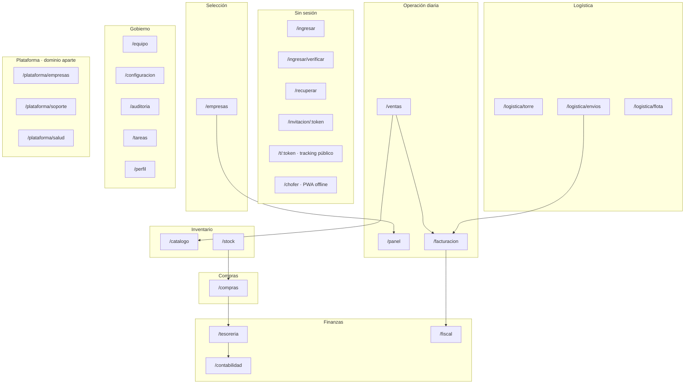

# Plan de Frontend de Producción · Control

**Documento:** Implementación del frontend de producción y sistema de diseño
**Versión:** 1.0
**Fecha:** 19 de septiembre de 2026
**Estado base:** Commit `f8811ad` sobre `main`. 25 migraciones aplicadas y verificadas contra PostgreSQL 16.15; 88 tablas, 23 vistas y 72 funciones; 948 verificaciones en verde en 6 suites; los 11 jobs del CI ejecutados y verificados localmente.
**Documentos relacionados:**
- [`PLAN-PRODUCCION.md`](PLAN-PRODUCCION.md) — puesta en producción y escalamiento multinacional. De ahí se heredan el principio de arquitectura de información (§4), el stack (§3.3) y las puertas de calidad (§8.4).
- [`PLAN-ERP-MULTIEMPRESA.md`](PLAN-ERP-MULTIEMPRESA.md) — brechas funcionales y fases E0–E9. **Este plan se ejecuta en paralelo a E7**, no lo reemplaza.
- `prototype/index.html` — prototipo de diseño que este plan reemplaza.

> **Estado de ejecución.** Las fases **F1 · Fundaciones**, **F2 · Identidad y acceso** y **F3 · Sistema de datos** están implementadas y verificadas. F1 entregó el sistema de diseño, la carcasa y las catorce ventanas. F2 entregó la sesión (cookie firmada `httpOnly`, resolución servidor), el ingreso (SSO simulado + credenciales + 2FA), la recuperación y la invitación, el selector de empresa, el cambio de empresa con descarte de cache, y la banda de impersonación. F3 entregó `packages/contracts` (esquemas Zod espejo de `pg_enum`), el `ApiClient` con `SimuladoCliente` validado en el borde, los hooks `useUrlState`/`useColeccion`, la `DataTable` con los cinco estados, y la ventana Catálogo como primer consumidor cableado. Lo que sigue es **F4 · Operación diaria**.
>
> Tres ajustes respecto de lo planeado, decididos al implementar y documentados donde corresponden:
> 1. `packages/contracts` y `packages/graficos` se crean en **F3** y **F4**, con su primer consumidor real, no en F1: un paquete sin consumidor es un lastre que nadie mantiene.
> 2. Las suites de lógica pura corren con el runner integrado de Node (`node --test`), como las de la API, y **sin dependencias de prueba**. Vitest y Playwright entran en F3, cuando haya componentes que renderizar y flujos que recorrer.
> 3. El atributo del tema es `data-tema="oscuro"` y no `data-theme="dark"`: el repositorio entero —esquema, código y documentos— está en español, y mezclar idiomas en el contrato de tokens habría sido la primera inconsistencia de muchas.

---

## Tabla de contenidos

1. [Resumen ejecutivo](#1-resumen-ejecutivo)
2. [Diagnóstico del prototipo actual](#2-diagnóstico-del-prototipo-actual)
3. [Sistema de diseño](#3-sistema-de-diseño)
4. [Arquitectura de información: una función, una ventana](#4-arquitectura-de-información-una-función-una-ventana)
5. [Arquitectura técnica](#5-arquitectura-técnica)
6. [Inventario de componentes](#6-inventario-de-componentes)
7. [Fases de implementación](#7-fases-de-implementación)
8. [Verificación y puertas de calidad](#8-verificación-y-puertas-de-calidad)
9. [Riesgos y decisiones irreversibles](#9-riesgos-y-decisiones-irreversibles)
10. [Anexo A · Tokens completos](#anexo-a--tokens-completos)
11. [Anexo B · Endpoints requeridos](#anexo-b--endpoints-requeridos)
12. [Anexo C · Checklist por ventana](#anexo-c--checklist-por-ventana)

---

## 1. Resumen ejecutivo

Hoy existe un **prototipo de diseño**: un único archivo `prototype/index.html` de 2.447 líneas, autocontenido, con 8 vistas que se alternan dentro de **una sola página con desplazamiento vertical**. Valida la estética y los flujos, pero no es un frontend de producción: no tiene rutas, no tiene contrato con la API, no tiene permisos, y concentra todas las funciones en un mismo documento.

Este plan lo reemplaza por una **aplicación Next.js 15 con una ventana por función**.

### Las tres decisiones que definen el plan

**1 · Una función, una ventana.** Se instancia en detalle el principio que `PLAN-PRODUCCION.md` §4.1 ya declaró y que el prototipo viola. El resultado es un árbol de **≈110 rutas agrupadas en 14 ventanas raíz** dentro de la carcasa de la empresa, más 5 ventanas fuera de ella. Cada ventana tiene su ruta, su permiso, su carga de datos, su bundle y **sus propios gráficos**.

**2 · La paleta indicada, con las escalas derivadas y medidas.** Los tres colores de la referencia —`#FFFFFF`, `#EF5F18` y `#261A66`— se convierten en un sistema de tokens completo: 3 escalas tonales de 12 pasos, 4 semánticos y los tonos de lienzo muestreados de la propia imagen. No hay un solo color literal en el código: todo pasa por tokens.

**3 · Carcasa oscura, área de trabajo clara.** La medición de contraste obligó a esta decisión y es el hallazgo central del plan: **sobre el violeta profundo, las superficies entre sí no llegan a 1,6:1** y WCAG 1.4.11 exige 3:1. La única separación real disponible es el blanco (18,44:1). Por eso la carcasa es violeta profundo —fiel a la imagen— y el área de trabajo es clara, con tarjetas blancas como en la referencia.

### Qué queda listo al terminar

| Resultado | Cómo se verifica |
|---|---|
| Aplicación con ≈110 rutas reales, cada función en su apartado | Test que recorre el mapa de rutas y exige guard, título y estado vacío en cada una |
| Sistema de tokens con la paleta aplicada, sin literales | Lint que falla ante cualquier `#RRGGBB` fuera de `packages/tokens` |
| Todas las combinaciones de color verificadas | Suite de contraste que itera tokens y paletas de inquilino y exige AA |
| Carcasa operable contra datos simulados | Los flujos de la cadena de venta (cotización → pedido → remito → factura → devolución) funcionando de punta a punta |
| Contrato con la API definido y validado | `packages/contracts` con esquemas Zod, y una suite que los valida contra el mock |
| Seam listo para el backend | Un flag de entorno cambia de mock a API real sin tocar componentes |

### Lo que este plan NO es

- **No es el backend.** El frontend se construye contra un contrato tipado y un adaptador simulado. La lista de endpoints que necesita está en el [Anexo B](#anexo-b--endpoints-requeridos) y es la entrada de la fase de backend.
- **No reemplaza a E7.** El plan del ERP sigue su curso (E7 · Recursos humanos). Cuando E7 exista, agrega ventanas a este mapa sin cambiar la arquitectura.
- **No incluye la app móvil nativa.** `/chofer` es una PWA offline-first, no una aplicación nativa.

---

## 2. Diagnóstico del prototipo actual

### 2.1 Lo que se conserva

El prototipo tiene piezas que valen y que se migran, no se reescriben:

| Pieza | Por qué se conserva |
|---|---|
| Gráficos SVG propios (`smoothPath`, `renderSalesChart`, `renderCategoryChart`, `sparkline`) | `PLAN-PRODUCCION.md` §3.3 ya decidió SVG propio + visx justamente porque una librería con estilos propios rompe el whitelabel. El prototipo demuestra que el enfoque funciona |
| Tooltip interactivo sobre la curva (`wireSalesHover`) | Ya resuelve el mapeo de coordenadas; se convierte en el primitivo `ChartTooltip` |
| Switcher de empresa con cambio de tokens en runtime (`applyBrand`) | El mecanismo es correcto: tokens por variable CSS. Se conserva y se endurece |
| Máquina de estados del tracking (`simulateEvent`) | El modelo de estados es el correcto; se conecta a `logistics.tracking_events` |
| Selector de plantilla por rubro (`renderTemplatePicker`) | Ya refleja `app.ui_templates` (5 plantillas sembradas) |
| Densidad por inquilino (`compact` / `comfy`) | Es una necesidad real de los rubros; se formaliza como token |

### 2.2 Los cuatro defectos que este plan corrige

**Defecto 1 · Una sola página con desplazamiento vertical.**
Las 8 vistas conviven en un mismo documento (`index.html`, 2.447 líneas) y se alternan por JavaScript. Consecuencias: un solo bundle, un solo *critical path*, imposible aislar fallos, imposible aplicar permisos por ventana, y el estado de la vista no vive en la URL —no se puede enlazar ni recargar una vista concreta.

**Defecto 2 · Las paletas de inquilino no pasan contraste.**
Medido sobre el lienzo nuevo, tres de las cuatro paletas del prototipo dejan el texto blanco por debajo del mínimo:

| Inquilino | Color primario | Blanco encima | Veredicto |
|---|---|---|---|
| Andes Trading | `#6D5EF8` | 4,56:1 | AA |
| Nórdico Retail | `#E879A6` | **2,72:1** | No cumple |
| Pampa Logística | `#10B981` | **2,54:1** | No cumple |
| Sur Servicios | `#F97316` | **2,80:1** | No cumple |

El sistema de marca escribe texto blanco sobre el color primario del inquilino **sin verificar nada**. Un cliente que elija verde o rosa recibe una aplicación inaccesible. La corrección está en §3.9.

**Defecto 3 · El glassmorphism sobre violeta profundo no separa superficies.**
El prototipo usa `rgba(255,255,255,0.045)` sobre `#070B18`. Es decir: **separa las tarjetas del fondo subiendo el brillo un 4,5%**, y el borde a `rgba(255,255,255,0.09)`. Medido contra el lienzo violeta de la paleta indicada:

| Par | Contraste | WCAG 1.4.11 (exige 3:1) |
|---|---|---|
| lienzo `#130D36` ↔ superficie `#1E154C` | 1,11:1 | No cumple |
| lienzo `#130D36` ↔ superficie `#3D3165` | 1,60:1 | No cumple |
| lienzo `#130D36` ↔ `scarlet-900 #261A66` | 1,25:1 | No cumple |
| superficie `#1E154C` ↔ `scarlet-900` | 1,12:1 | No cumple |
| **lienzo `#130D36` ↔ blanco `#FFFFFF`** | **18,44:1** | **Cumple** |

La conclusión es dura y útil: **en esta familia de colores, la elevación no se puede expresar con luminosidad.** La única separación real es el blanco. Eso determina la arquitectura de temas de §3.4.

**Defecto 4 · Los datos son simulados en el cliente.**
`seeded()`, `buildSalesSeries()`, `renderLowStock()` y `renderShipments()` generan datos con un generador pseudoaleatorio sembrado. No hay contrato con la API, ni validación, ni estados de carga o error. El frontend no puede saber si un dato es válido.

### 2.3 Lo que el prototipo demuestra y hay que preservar como comportamiento

- El cambio de empresa **no recarga la página** y las gráficas se repintan.
- El tracking **emite eventos en vivo** con máquina de estados y notificaciones.
- Las exportaciones muestran **qué identidad resuelve el servidor** (no la del cliente).
- La densidad cambia con el rubro.

---

## 3. Sistema de diseño

### 3.1 La paleta indicada y el rol de cada color

Los tres colores de la referencia, y el papel que cumple cada uno:

| Color | Hex | Rol en el sistema | Dónde aparece |
|---|---|---|---|
| **WHITE** | `#FFFFFF` | Superficie de contenido | Tarjetas, tablas, formularios, área de trabajo |
| **ORANGE** | `#EF5F18` | Acción y acento | Botón primario, enlaces, series destacadas, foco, indicadores activos |
| **SCARLET BIKINI** | `#261A66` | Marca y estructura | Carcasa, barra lateral, encabezados, texto principal sobre claro |

Además, del muestreo de la propia imagen se extraen los tonos que la referencia usa y no declara. Son los que permiten construir el lienzo oscuro:

| Muestra | Hex | Presencia en la imagen |
|---|---|---|
| Fondo profundo dominante | `#130D36` | 9,7% + 9,5% |
| Violeta profundo secundario | `#1E154C` | 4,3% |
| Violeta medio | `#3D3165` | 8,9% |
| Contrafondo claro | `#E7E4E8` | 11,5% |

> **Nota de método.** El violeta de la imagen (`#281C64`, 12,6%) y el naranja (`#EB5F1C`, 16,0%) aparecen en el muestreo desplazados por la compresión y la iluminación de la fotografía. El sistema usa los valores **declarados** (`#261A66`, `#EF5F18`) como ancla y deriva de ellos; los muestreados se usan sólo para el lienzo, donde no hay un valor declarado.

### 3.2 Escalas tonales

Tres escalas de 12 pasos. El color indicado está **clavado en su paso natural** (no aproximado): `scarlet-900` es exactamente `#261A66` y `orange-600` es exactamente `#EF5F18`.

> **Método de derivación.** Cada escala se genera desde el tono, la saturación y la luminosidad del ancla, con una rampa de luminosidad perceptualmente espaciada y una corrección de saturación que la baja en los extremos claros —para que no se laven— y la sube en los oscuros. El paso ancla se asigna **exacto**, no interpolado. El ancla de `scarlet` es 900 porque `#261A66` es un color oscuro; el de `orange` es 600 porque `#EF5F18` es un color de luminosidad media. La Fase F1 implementa el generador y la suite de contraste en TypeScript, de modo que cambiar un ancla regenera las escalas y **vuelve a verificar todos los pares**.

**Scarlet** — ancla en 900 = `#261A66`

| Paso | Hex | Uso |
|---|---|---|
| 50 | `#F7F7FA` | Fondo de página en tema claro |
| 100 | `#ECEBF4` | Fondo de sección, cebra de tabla |
| 200 | `#DAD7EA` | Bordes suaves, divisores |
| 300 | `#C4BFDF` | Bordes, iconos inactivos |
| 400 | `#AAA2D4` | Texto deshabilitado |
| 500 | `#8C81C9` | Texto secundario sobre claro |
| 600 | `#6B5BC0` | Acento violeta, series de gráfico |
| 700 | `#4E3CAF` | Enlaces, estados hover |
| 800 | `#392A8C` | Estados activos, texto sobre claro |
| **900** | **`#261A66`** | **Marca: carcasa, encabezados, texto principal** |
| 950 | `#1A1243` | Texto sobre naranja, sombras de texto |
| 990 | `#100C27` | Tinta máxima, texto sobre naranja |

**Orange** — ancla en 600 = `#EF5F18`

| Paso | Hex | Uso |
|---|---|---|
| 50 | `#FBF8F6` | Fondo de aviso suave |
| 100 | `#F5ECE7` | Fondo de chip |
| 200 | `#EED9CE` | Borde de aviso |
| 300 | `#E8C1AD` | Serie de gráfico suave |
| 400 | `#E5A485` | Serie de gráfico, texto naranja sobre violeta (7,04:1) |
| 500 | `#E78453` | Serie intermedia |
| **600** | **`#EF5F18`** | **Acción: botón primario, enlaces, foco** |
| 700 | `#C24A0F` | Botón primario sobre claro (blanco encima: 4,91:1) |
| 800 | `#993B0D` | Texto naranja sobre claro (7,03:1) |
| 900 | `#732D0B` | Texto sobre naranja claro |
| 950 | `#502008` | Sombras cálidas |
| 990 | `#2E1305` | Tinta cálida |

**Neutral** — con un sesgo violeta del 10%, para que el gris no compita con la marca

| Paso | Hex | Uso |
|---|---|---|
| 50 | `#F8F8F9` | Superficie de contenido alterna |
| 100 | `#F0F0F2` | Fondo de campo deshabilitado |
| 200 | `#E2E2E7` | Bordes de campo, divisores |
| 300 | `#CDCBD5` | Bordes de control, placeholder |
| 400 | `#B1AFBE` | Texto secundario sobre oscuro |
| 500 | `#9390A4` | Texto deshabilitado |
| 600 | `#76728B` | Texto terciario sobre claro (4,64:1) |
| 700 | `#5B586C` | Texto secundario sobre claro (6,83:1) |
| 800 | `#444150` | Texto principal alterno |
| 900 | `#312F3A` | — |
| 950 | `#222129` | — |
| 990 | `#18171C` | — |

### 3.3 Colores semánticos

Armonizados con el lienzo violeta, no importados de una paleta genérica:

| Semántico | Base | Claro (fondo) | Profundo (tinta sobre claro) | Base sobre el lienzo |
|---|---|---|---|---|
| Éxito | `#2FC48A` | `#DEEDE7` | `#1C7653` | 8,2:1 |
| Atención | `#F5B22E` | `#F1E9DA` | `#8E6007` | 9,9:1 |
| Peligro | `#F2555A` | `#F0DBDB` | `#C50F15` | 5,5:1 |
| Información | `#539BF5` | `#DAE4F1` | `#0C60C9` | 6,5:1 |

Cada semántico tiene siempre **tres** valores y se usan en el rol que corresponde: el claro como fondo, el profundo como tinta sobre fondo claro, y la base como icono o texto sobre el lienzo oscuro.

**La tinta profunda no es «la base más oscura», es la más viva que todavía cumple.** Se calculó buscando, para cada semántico, la luminosidad más alta que mantiene 4,5:1 sobre su propio fondo claro: de ahí los valores por encima del mínimo (4,55:1 a 4,63:1) en lugar de tintas innecesariamente oscuras. Usar la base como texto sobre el fondo claro es el error más común de esta familia —`#2FC48A` sobre `#DEEDE7` da 1,85:1— y el lint de contraste lo detecta.

### 3.4 Arquitectura de temas: carcasa oscura, área de trabajo clara

Es la decisión estructural del plan, y **se deriva de la medición**, no de una preferencia.

El dato: sobre la familia violeta, las superficies entre sí no superan 1,60:1 y WCAG 1.4.11 exige 3:1 para límites de control. Un tema íntegramente oscuro obligaría a poner borde a cada tarjeta, cada fila y cada panel para que se distingan, y dejaría las tablas densas —que es donde el usuario pasa ocho horas— sobre un fondo de bajo contraste.

La solución es la que la propia referencia muestra: **el violeta profundo es la estructura y el blanco es el contenido.**

| Región | Superficie | Por qué |
|---|---|---|
| Carcasa: barra lateral, encabezado, barra inferior móvil | `scarlet-990 #100C27` con texto `neutral-100` | Es la marca. Ocupa poco y enmarca |
| Lienzo del área de trabajo | `scarlet-50 #F7F7FA` | Neutro y luminoso, sin competir con las tarjetas |
| Tarjeta | `#FFFFFF` con borde `neutral-200` | 18,44:1 contra la carcasa. Es la separación que la medición sí permite |
| Tarjeta destacada | `#FFFFFF` con borde izquierdo `orange-600` de 3px | Para el KPI o la alerta que debe leerse primero |
| Superficie invertida (cabecera de tabla, panel de totales) | `scarlet-900 #261A66` con texto `#FFFFFF` | 14,77:1. El violeta vuelve como bloque sólido |
| Superficie de énfasis | `orange-600 #EF5F18` | Sólo para la acción principal o un bloque de una línea. Nunca para texto corrido |

**El tema oscuro completo** se ofrece como variante (`data-theme="dark"`), no como defecto, y su presupuesto es explícito: como la elevación no puede expresarse con luminosidad, **toda superficie del tema oscuro lleva borde**. Es la única forma de cumplir 1.4.11 en esa familia. Queda implementado y verificado, pero no es el tema por defecto.

> **Decisión reversible a bajo costo.** Los dos temas son el mismo conjunto de tokens con valores distintos. Cambiar cuál es el defecto es cambiar un atributo. Lo que no es reversible es tener colores literales en los componentes, y eso el lint lo impide desde la Fase F1.

### 3.5 Reglas de contraste medidas

Estas tablas son el contrato de color del sistema. Cualquier combinación que no aparezca acá debe medirse antes de usarse.

**Texto sobre el lienzo oscuro (carcasa)**

| Combinación | Contraste | Veredicto |
|---|---|---|
| Blanco `#FFFFFF` / `#130D36` | 18,44:1 | AAA |
| `neutral-200` / `#130D36` | 14,29:1 | AAA |
| `scarlet-300` / `#130D36` | 10,40:1 | AAA |
| `neutral-400` / `#130D36` | 8,57:1 | AAA |
| `orange-600` / `#130D36` | 5,55:1 | AA |
| `orange-700` / `#130D36` | 3,76:1 | Sólo texto grande |

**Texto sobre superficie clara**

| Combinación | Contraste | Veredicto |
|---|---|---|
| `scarlet-900` / blanco | 14,77:1 | AAA |
| `scarlet-900` / `#E7E4E8` | 11,72:1 | AAA |
| `neutral-700` / blanco | 6,83:1 | AA |
| `neutral-600` / blanco | 4,64:1 | AA (mínimo aceptable) |
| `orange-800` / blanco | 7,03:1 | AAA |
| `orange-700` / blanco | 4,91:1 | AA |
| `orange-600` / blanco | 3,32:1 | **Sólo texto grande** |
| `orange-600` / `#E7E4E8` | **2,64:1** | **Prohibido** |

**Texto sobre el violeta sólido**

| Combinación | Contraste | Veredicto |
|---|---|---|
| Blanco / `scarlet-900` | 14,77:1 | AAA |
| `neutral-300` / `scarlet-900` | 9,21:1 | AAA |
| `orange-400` / `scarlet-900` | 7,04:1 | AAA |
| `orange-600` / `scarlet-900` | 4,44:1 | Sólo texto grande |

**Texto sobre el naranja de acción** — el caso del botón primario

| Combinación | Contraste | Veredicto |
|---|---|---|
| `scarlet-990` / `orange-600` | 5,73:1 | **AA — es la opción del botón primario** |
| `scarlet-950` / `orange-600` | 5,22:1 | AA |
| Blanco / `orange-700` | 4,91:1 | AA — alternativa sobre fondos claros |
| Blanco / `orange-600` | 3,32:1 | **Sólo texto grande (≥19px bold)** |
| Blanco / `orange-800` | 7,03:1 | AAA — para texto blanco en bloque naranja |

**Las cinco prohibiciones del sistema**, cada una respaldada por un número:

1. **Blanco sobre `orange-600` por debajo de 19px bold.** Es 3,32:1. El botón primario usa `scarlet-990` como tinta sobre el naranja — que además es la pareja de marca de la referencia.
2. **`orange-600` como texto sobre superficie clara.** Es 2,64:1 sobre el contrafondo. Sobre claro, el naranja de texto es `orange-800`.
3. **Elevación por luminosidad en la familia violeta.** No llega a 3:1. En el tema oscuro, toda superficie lleva borde.
4. **Gris puro.** El neutral tiene un sesgo violeta del 10% a propósito: un gris neutro al lado de `#261A66` se lee sucio.
5. **Un color de serie de gráfico fuera de la escala.** Las series salen de `scarlet-600`, `orange-600`, `neutral-500` y los cuatro semánticos, en ese orden.

### 3.6 Tipografía

Dos familias, servidas localmente (sin CDN: la aplicación debe funcionar en una red restringida y no puede depender de un tercero para renderizar).

| Rol | Familia | Motivo |
|---|---|---|
| Títulos y cifras | **Space Grotesk** | Es la del prototipo para los rubros «duros» (distribuidora, logística). Tiene cifras tabulares, que es lo que hace que una columna de importes se lea |
| Cuerpo y formularios | **Inter** | Alta legibilidad en tamaños chicos; es la del prototipo para retail y servicios |

Escala tipográfica (1,25 de razón):

| Token | Tamaño / interlineado | Uso |
|---|---|---|
| `--text-xs` | 11 / 16 | Etiqueta de tabla, metadato |
| `--text-sm` | 13 / 20 | Texto de tabla, ayuda de campo |
| `--text-base` | 15 / 24 | Cuerpo |
| `--text-lg` | 18 / 28 | Título de tarjeta |
| `--text-xl` | 22 / 30 | Título de sección |
| `--text-2xl` | 28 / 36 | Título de ventana |
| `--text-3xl` | 36 / 44 | Cifra de KPI |
| `--text-4xl` | 46 / 52 | Cifra de KPI principal |

**Cifras siempre tabulares** (`font-variant-numeric: tabular-nums`) en toda columna numérica, total y saldo. Sin esto, los importes bailan al ordenar y la lectura de una columna se vuelve imposible.

**Umbral del texto grande:** 19px bold o 24px regular. Es el umbral de WCAG para AA-grande y aparece en tres prohibiciones de §3.5, así que se define una sola vez y el lint lo conoce.

### 3.7 Espaciado, radios, elevación y movimiento

**Espaciado** — base de 4px: `2, 4, 8, 12, 16, 20, 24, 32, 40, 48, 64`.

**Radios** — `--radius-sm: 8px` (campos, chips) · `--radius: 12px` (tarjetas) · `--radius-lg: 18px` (paneles) · `--radius-full` (píldoras, avatares).

**Elevación** — en el tema claro: `--shadow-sm: 0 1px 2px rgba(38,26,102,0.06)` · `--shadow: 0 2px 8px rgba(38,26,102,0.08)` · `--shadow-lg: 0 8px 24px rgba(38,26,102,0.12)`. **La sombra se tiñe de violeta**, no de negro: sobre superficies claras una sombra negra se lee como suciedad.

**Movimiento** — `--dur-fast: 120ms` · `--dur: 200ms` · `--dur-slow: 320ms`, con `--ease: cubic-bezier(0.2, 0, 0, 1)`.

Reglas: toda animación respeta `prefers-reduced-motion` (y el sistema provee el modo reducido de forma global, no por componente); ninguna transición supera 320ms; **no se anima nada que el usuario esté leyendo** —los contadores de KPI se animan una sola vez al cargar, no en cada refresco—; el esqueleto de carga usa un barrido de 1,2s.

**Densidad** — dos modos por inquilino (`compact` / `comfy`), como en el prototipo, pero implementados como **token numérico** (`--density: 0.85 | 1`) que multiplica alturas de fila y espaciados de control. No como dos juegos de componentes.

### 3.8 Iconografía

Set propio de 24×24 con trazo de 1,75, exportado como componentes React. Se migran los iconos que el prototipo ya dibuja inline (son correctos y coherentes). Reglas: el icono **nunca** es el único portador de significado (siempre acompañado de texto o `aria-label`); los iconos de estado llevan su color semántico; no se usan emojis como iconos de interfaz.

### 3.9 Marca por inquilino y la corrección del defecto de accesibilidad

El servidor resuelve la identidad del inquilino en `app.tenant_branding`, que ya tiene exactamente los campos necesarios: `color_primary`, `color_secondary`, `color_accent`, `color_surface`, `color_text`, `font_heading`, `font_body`, `template_key`, `template_config`, `logo_url`, `logo_dark_url`, `favicon_url`, `document_header`, `document_footer`. El frontend los aplica como variables CSS.

**El defecto y su corrección.** Hoy el sistema escribe texto blanco sobre `color_primary` sin verificar. Medido, tres de las cuatro paletas del prototipo fallan. La corrección tiene tres partes:

1. **La tinta se deriva, no se fija.** `resolveOnColor(color)` calcula el contraste de blanco y de `scarlet-990` contra el color dado y devuelve el que supere 4,5:1. Si ninguno lo supera, devuelve el de mayor contraste y **marca la paleta como no conforme**.
2. **La conformidad es visible en la ventana de identidad.** `/configuracion/identidad` muestra, junto a cada color, el contraste resultante y un aviso cuando no alcanza AA. El cliente ve el problema mientras elige, no después.
3. **Hay una puerta.** Una suite itera **todas** las paletas —las de los inquilinos reales y las de las 5 plantillas de `app.ui_templates`— y exige AA. Una paleta nueva que no cumpla rompe el build.

Además, `color_primary` del inquilino **no pinta la carcasa**: la carcasa es siempre `scarlet-900` del sistema. El color del inquilino aparece en el logotipo, el acento, las series de gráfico y los documentos. Motivo: si el inquilino pintara la carcasa, el contraste del texto de navegación pasaría a depender de un color que el cliente puede elegir libremente — que es exactamente el defecto que estamos corrigiendo.

### 3.10 Los tokens como paquete

Los tokens viven en `packages/tokens` y son **la única fuente**. De ahí se generan tres artefactos:

| Salida | Consumidor |
|---|---|
| `tokens.css` con las variables `--control-*` | La aplicación, vía `@import` |
| `theme.ts` con el mapa tipado | Tailwind (`@theme`) y los gráficos, que necesitan valores en JS |
| `tokens.json` | Herramientas de diseño y la suite de contraste |

Ningún componente escribe un color, un tamaño de fuente ni un radio literal. El lint de la Fase F1 lo verifica.

---

## 4. Arquitectura de información: una función, una ventana

### 4.1 El principio

`PLAN-PRODUCCION.md` §4.1 lo declara: *cada módulo es una ventana independiente: su propia ruta, su propia carga de datos, su propio permiso, su propio bundle. No hay un dashboard monolítico con pestañas que carguen todo.*

Este plan **lo instancia y lo extiende**. El mapa de ventanas de §4.2 de aquel documento (W1–W13) cubre 13 ventanas; la base ya soporta más módulos que esos —compras, tesorería, contabilidad, fiscal, devoluciones, precios, auditoría y tareas no tienen ventana asignada—. El árbol de §4.2 de este documento las incorpora todas.

**Lo que cambia respecto del prototipo, en concreto:** hoy las 8 vistas son secciones de un documento con scroll. Pasarán a ser **rutas reales**, cada una con su URL, su carga y su bundle. Consecuencia inmediata y verificable: recargar la página en `/ventas/remitos/[id]` abre ese remito, y un enlace a una factura se puede compartir.

### 4.2 Árbol de rutas



**Ventanas raíz dentro de la carcasa de la empresa (14).** Cada una con sus sub-rutas:

| # | Ventana | Raíz | Sub-rutas |
|---|---|---|---|
| 1 | Panel de control | `/panel` | — |
| 2 | Ventas | `/ventas` | `pedidos`, `pedidos/nuevo`, `pedidos/[id]`, `cotizaciones`, `cotizaciones/nueva`, `cotizaciones/[id]`, `remitos`, `remitos/[id]`, `devoluciones`, `devoluciones/[id]`, `clientes`, `clientes/[id]`, `cuenta-corriente`, `precios`, `precios/[id]` |
| 3 | Facturación | `/facturacion` | `nueva`, `[id]`, `cola`, `notas-de-credito`, `libro-iva` |
| 4 | Catálogo | `/catalogo` | `nuevo`, `[id]`, `categorias`, `marcas`, `importar` |
| 5 | Stock | `/stock` | `movimientos`, `depositos`, `transferencias`, `transferencias/nueva`, `transferencias/[id]`, `reposicion`, `recuento`, `conciliacion` |
| 6 | Compras | `/compras` | `proveedores`, `proveedores/[id]`, `ordenes`, `ordenes/nueva`, `ordenes/[id]`, `recepciones`, `recepciones/[id]`, `facturas`, `facturas/[id]`, `pagos`, `cuenta-corriente` |
| 7 | Tesorería | `/tesoreria` | `cuentas`, `cuentas/[id]`, `movimientos`, `cobros`, `pagos`, `cheques`, `conciliaciones`, `conciliaciones/[id]` |
| 8 | Contabilidad | `/contabilidad` | `asientos`, `asientos/[id]`, `plan-de-cuentas`, `periodos`, `balance`, `reglas`, `pendientes` |
| 9 | Fiscal | `/fiscal` | `determinacion`, `retenciones`, `comprobantes`, `comprobantes/[id]`, `alicuotas`, `libros`, `credenciales` |
| 10 | Logística | `/logistica` | `torre`, `envios`, `envios/nuevo`, `envios/[id]`, `flota`, `transportistas`, `incidencias`, `pod` |
| 11 | Equipo | `/equipo` | `miembros`, `roles`, `invitaciones` |
| 12 | Configuración | `/configuracion` | `identidad`, `plantillas`, `empresa`, `impuestos`, `integraciones` |
| 13 | Auditoría | `/auditoria` | — |
| 14 | Tareas | `/tareas` | `[id]` |

**Ventanas fuera de la carcasa (5):** ingreso, selección de empresa, tracking público, app de conductor y consola de plataforma (esta última en dominio separado).

**Total: ≈110 rutas.**

### 4.3 Matriz maestra de ventanas

Cada ventana declara, en un único archivo (`apps/web/src/routes.ts`), su ruta, su permiso, su bandera de funcionalidad, sus vistas internas, los datos que consume y sus gráficos. **El archivo es la fuente del menú, de las guardas y de los tests**: no hay una lista de navegación aparte que pueda desincronizarse.

| Ventana | Permiso | Feature | Datos (vistas y tablas reales) | Gráficos propios |
|---|---|---|---|---|
| **Panel** | sesión | — | `billing.v_sales_daily`, `ops.v_job_health`, `app.v_low_stock` | Ventas del período (área), embudo de documentos (barras), cumplimiento de SLA (dona) |
| **Ventas** | `sales.read` | — | `billing.sales_orders` + `_items`, `billing.v_quotes`, `billing.delivery_notes`, `billing.customer_returns` | Embudo cotización→pedido→remito→factura (barras), evolución diaria (línea), mix por canal (dona) |
| **Facturación** | `billing.read` | — | `billing.invoices` + `_items` + `_taxes`, `billing.afip_outbox`, `billing.afip_request_log` | Cola de emisión por estado (barras apiladas), tasa de CAE al primer intento (línea), IVA por alícuota (dona) |
| **Catálogo** | `catalog.read` | — | `app.products`, `app.product_variants`, `app.categories`, `app.brands` | Mix por categoría (dona), precio promedio por categoría (barras), curva ABC (línea acumulada) |
| **Stock** | `inventory.read` | — | `app.stock_levels`, `app.stock_movements`, `app.warehouses`, `app.stock_transfers`, `app.v_low_stock` | Niveles por depósito (barras apiladas), cobertura en días (barras horizontales), movimientos netos (barras divergentes), rotación (línea) |
| **Compras** | `purchasing.read` ⟵ *falta* | — | `purchasing.supplier_orders`, `goods_receipts`, `supplier_invoices`, `v_payables_aging`, `v_pending_receipts`, `v_supplier_balances` | Pendientes de recepción (barras), antigüedad de CxP (barras apiladas), evolución de costo de compra (línea) |
| **Tesorería** | `treasury.read` ⟵ *falta* | — | `treasury.accounts`, `movements`, `checks`, `v_treasury_position`, `v_account_balances`, `v_check_portfolio` | Posición consolidada (área apilada), flujo proyectado (barras), cartera de cheques por vencimiento (barras por tramo) |
| **Contabilidad** | `accounting.read` ⟵ *falta* | — | `accounting.journal_entries` + `_lines`, `accounts`, `periods`, `v_trial_balance`, `v_posting_gaps`, `mapping_rules` | Balance de sumas y saldos (tabla con sparkline), evolución del resultado (línea), brechas de imputación (barras) |
| **Fiscal** | `fiscal.read` ⟵ *falta* | — | `fiscal.tax_documents`, `vat_accruals`, `tax_rates`, `v_vat_position`, `v_vat_period_summary`, `v_withholdings_period` | Posición de IVA (barras divergentes), ventas y compras por período (líneas), retenciones por régimen (dona) |
| **Logística** | `logistics.read` | `logistics.enabled` | `logistics.shipments`, `shipment_stops`, `tracking_events`, `v_shipment_board`, `delivery_confirmations` | Mapa en vivo (SSE), cumplimiento de SLA (dona), entregas por día (barras), incidencias por causa (barras horizontales) |
| **Equipo** | `team.manage` | — | `app.memberships`, `roles`, `role_permissions`, `users` | Actividad por miembro (barras), distribución de roles (dona) |
| **Configuración** | `tenant.settings` | — | `app.tenants`, `tenant_branding`, `ui_templates` | — |
| **Auditoría** | `audit.read` | — | `audit.events` (particionada), `audit.v_default_partition_usage` | Eventos por tipo (barras), por día (línea), uso de partición por defecto (indicador) |
| **Tareas** | `tenant.settings` | — | `ops.jobs`, `ops.job_runs`, `ops.v_job_health` | Duración por job (barras), atrasos (línea), tasa de fallo (indicador) |

**Cada ventana tiene sus propios gráficos.** No hay un panel genérico de gráficos que se reutilice entre ventanas: un gráfico de IVA por alícuota no tiene sentido en Stock, y forzarlo obliga a un componente configurable que termina siendo un motor de gráficos genérico. Los primitivos (ejes, tooltip, leyenda, formato) se comparten; **las series y su semántica son de cada ventana.**

### 4.4 La carcasa

```
┌──────────────────────────────────────────────────────────────┐
│  ▲ Control        [ Empresa ▾ ]   ⌘K      🔔 3      EM ▾     │  ← encabezado, scarlet-990
├────────────┬─────────────────────────────────────────────────┤
│ Operación  │  Ventas › Remitos › R-0001-00000123             │  ← migas, sobre lienzo claro
│  Panel     │ ┌─────────────────────────────────────────────┐ │
│  Ventas  ● │ │  [KPI] [KPI] [KPI] [KPI]                    │ │
│  Facturación│ └─────────────────────────────────────────────┘ │
│ Inventario │ ┌───────────────────────┬─────────────────────┐ │
│  Catálogo  │ │  Listado + filtros    │  Panel de detalle   │ │
│  Stock     │ │                       │                     │ │
│ Compras    │ └───────────────────────┴─────────────────────┘ │
│ Finanzas   │                                                 │
│  Tesorería │                                                 │
│  Contab.   │                                                 │
│  Fiscal    │                                                 │
│ Logística  │                                                 │
│ Gobierno   │                                                 │
│  Equipo    │                                                 │
│  Config.   │                                                 │
│  Auditoría │                                                 │
│  Tareas    │                                                 │
└────────────┴─────────────────────────────────────────────────┘
```

**Elementos:**

- **Encabezado** — logotipo de la empresa, selector de empresa, buscador global (`⌘K`), notificaciones, menú de usuario. Fondo `scarlet-990`, texto `neutral-100`.
- **Barra lateral** — agrupada por dominio (Operación, Inventario, Compras, Finanzas, Logística, Gobierno), **generada desde `routes.ts` filtrada por permisos y banderas**. Colapsable; en móvil es un cajón. El ítem activo lleva una barra naranja de 3px — el acento de acción, que es lo que indica «estás acá».
- **Migas de pan** — derivadas de la ruta, siempre presentes salvo en las raíces.
- **Buscador global** (`⌘K`) — navegación a ventanas y entidades (cliente, producto, comprobante, envío). Es la respuesta al problema que crea tener 110 rutas: encontrar sin recordar dónde está. Alcance acotado a lo que el usuario tiene permiso de ver.
- **Área de trabajo** — lienzo `scarlet-50`, tarjetas blancas.
- **Barra inferior móvil** — sólo en pantallas chicas, con las 4 ventanas más usadas del rol.

**Prohibido en la carcasa:** pintar la carcasa con el color del inquilino (§3.9), cargar datos de módulos ajenos a la ventana activa, y cualquier ítem de navegación construido con condiciones dispersas en lugar del mapa de rutas.

### 4.5 Reglas de arquitectura de información

Se conservan A1–A7 de `PLAN-PRODUCCION.md` §4.4 y se agregan cinco, que son las que este plan necesita para ser verificable:

| # | Regla | Verificación |
|---|---|---|
| A1 | Toda ventana declara su permiso requerido en un único lugar (el mapa de rutas) | Test que recorre el mapa y verifica que cada ruta tenga guard |
| A2 | El menú se genera desde los permisos del usuario, no desde una lista estática | Test: un usuario `warehouse` no ve el ítem de facturación |
| A3 | Ninguna ventana carga datos de un módulo que no es el suyo | Revisión de dependencias en el código |
| A4 | Los módulos opcionales respetan `tenants.features` | Test: con `logistics.enabled=false`, la ruta responde 404 y el ítem no aparece |
| A5 | Toda ventana tiene estado vacío, de carga y de error explícitos | Checklist de revisión de UI |
| A6 | Ninguna ventana supera los 3 niveles de navegación desde el menú raíz | Revisión de UX |
| A7 | Las ventanas de sólo lectura no renderizan controles de escritura, ni deshabilitados | Revisión de UX |
| **A8** | **Toda ventana tiene su propio título, sus migas y su URL compartible** | Test: navegar a cada ruta y comparar el título del documento con el declarado |
| **A9** | **Ninguna ventana renderiza más de 60 filas sin paginar o virtualizar** | Revisión de componentes de tabla |
| **A10** | **Toda lista con más de 100 elementos ofrece filtro persistido en la URL** | Test de serialización de filtros |
| **A11** | **Ningún gráfico es el único portador de un dato**: siempre hay tabla o texto equivalente | Checklist de accesibilidad |
| **A12** | **El estado de la ventana vive en la URL** (filtros, página, orden, pestaña) | Test: recargar restaura la vista |

**A12 es la regla que más cambia el trabajo diario.** En el prototipo, el estado de la vista no está en ningún lado: recargar vuelve al principio. Con A12, un encargado puede mandarle a otro el enlace exacto de «remitos pendientes de facturar de este cliente, ordenados por fecha».

### 4.6 Estados obligatorios por ventana

Cinco estados, todos explícitos, ninguno improvisado:

| Estado | Cuándo | Cómo se ve |
|---|---|---|
| **Carga** | Primera carga de la ventana | Esqueleto con la forma del contenido real, no un indicador giratorio centrado |
| **Carga parcial** | Refresco con datos ya en pantalla | Barra fina de progreso arriba; **los datos viejos siguen visibles** |
| **Vacío** | Sin datos | Explica qué es esta ventana y cuál es la primera acción. Nunca «No hay datos» |
| **Error** | Fallo de datos | Qué falló, `requestId`, botón de reintento. Si el error es de permisos, no es un error: es un 403 con explicación |
| **Sin permiso** | El usuario no puede ver la ventana | 403 con la ventana en el menú **visible pero bloqueada** y el rol que haría falta |

### 4.7 Permisos: el hueco del RBAC y qué falta sembrar

El modelo real tiene **33 permisos en 13 recursos y 7 roles de sistema**:

| Rol | Permisos | Rol | Permisos |
|---|---|---|---|
| `owner` Propietario | 33 | `warehouse` Encargado de depósito | 10 |
| `admin` Administrador | 31 | `viewer` Sólo lectura | 6 |
| `accountant` Contador | 12 | `driver` Conductor | 3 |
| `sales` Vendedor | 11 | | |

Recursos existentes: `audit`, `billing`, `catalog`, `customers`, `inventory`, `logistics`, `payments`, `reports`, `sales`, `team`, `tenant`.

**El hueco.** Cuatro de las catorce ventanas no tienen permiso que las cubra:

| Ventana | Permiso actual | Qué falta |
|---|---|---|
| Compras | ninguno | `purchasing.read`, `purchasing.write`, `purchasing.receive`, `purchasing.pay` |
| Tesorería | sólo `payments.manage` | `treasury.read`, `treasury.write`, `treasury.reconcile`, `treasury.checks` |
| Contabilidad | ninguno (sólo `reports.financial`) | `accounting.read`, `accounting.post`, `accounting.close`, `accounting.manage_accounts` |
| Fiscal | sólo `billing.afip_credentials` | `fiscal.read`, `fiscal.determine`, `fiscal.withholdings`, `fiscal.manage_rates` |

**Este hueco es un bloqueante para las ventanas de la Fase F6**, y se resuelve con una migración de datos (`0026_rbac_finance_and_supply.sql`) que siembra los permisos, los asigna a los roles de sistema y extiende `app.assert_rls_coverage`-style: una aserción de que **todo recurso del mapa de rutas tiene su permiso sembrado**. Es el mismo patrón que el proyecto ya usa con las tablas: si el mapa de rutas declara un recurso que no existe en `app.permissions`, el build falla.

> **Nota de coherencia con el plan del ERP.** Esta migración es de datos y no toca el esquema, así que no colisiona con E7. Se numera `0026` y se coordina con la numeración de E7 en el momento de escribirla.

---

## 5. Arquitectura técnica

### 5.1 Stack

Se adopta el que `PLAN-PRODUCCION.md` §3.3 ya decidió, con las concreciones que faltaban:

| Capa | Decisión | Nota |
|---|---|---|
| Framework | **Next.js 15, App Router, React 19** | Server Components por defecto |
| Lenguaje | **TypeScript 5.6**, `strict` y `noUncheckedIndexedAccess` | Ya es la versión del repo |
| Estilos | **Tailwind CSS v4** con `@theme` mapeado a las variables de `packages/tokens` | v4 porque los tokens *son* variables CSS: encaja sin traducción |
| Primitivos de UI | **Radix UI** | Accesibilidad sin estilo impuesto |
| Estado servidor | **TanStack Query v5** | Cache, reintentos, invalidación |
| Tablas | **TanStack Table v8** | Cabeceras ordenables, virtualización, columnas configurables |
| Formularios | **react-hook-form + Zod** | Los mismos esquemas Zod del contrato |
| Gráficos | **visx + SVG propio** | Migrando los del prototipo |
| Estado de interfaz | **Zustand**, mínimo | Sólo lo que no es servidor ni URL |
| Internacionalización | **next-intl** | `es-AR` primero; preparado para `pt-BR` y `es-MX` |
| Pruebas | **`node --test`** para la lógica pura · **Vitest** + Testing Library y **Playwright** desde F3 | Node 22 ejecuta TypeScript directamente, así que las suites de tokens y de rutas no tienen ninguna dependencia. Vitest entra cuando haya componentes que renderizar y Playwright cuando haya flujos que recorrer |
| Datos simulados | **MSW** | Es la pieza que permite construir el frontend antes del backend |

### 5.2 Estructura del monorepo

El repo ya declara `apps/*` y `packages/*` como workspaces y `packages/` está vacío. La estructura que se crea:

```
Control/
├── apps/
│   ├── api/                        # existente, sin cambios
│   └── web/                        # NUEVO · Next.js
│       └── src/
│           ├── app/                # App Router
│           │   ├── (publico)/      # ingreso, recuperar, tracking, chofer
│           │   ├── (seleccion)/    # selector de empresa
│           │   ├── e/[slug]/       # carcasa por empresa
│           │   └── plataforma/     # consola de plataforma
│           ├── ventanas/           # una carpeta por ventana del mapa
│           │   ├── panel/
│           │   ├── ventas/
│           │   ├── facturacion/
│           │   └── ...             # 14 en total
│           ├── componentes/        # carcasa y composiciones
│           ├── datos/              # cliente HTTP, adaptador, hooks de consulta
│           ├── rutas.ts            # ★ el mapa de ventanas: fuente del menú y de las guardas
│           └── estilos/
├── packages/
│   ├── tokens/                     # NUEVO · única fuente de color, tipografía, geometría
│   ├── contracts/                  # NUEVO · esquemas Zod + tipos del dominio
│   ├── ui/                         # NUEVO · componentes sin lógica de negocio
│   ├── graficos/                   # NUEVO · primitivos de gráfico y series por dominio
│   └── shared/                     # existente
```

**Sobre el orden de creación de los paquetes.** `tokens` y `ui` existen desde F1 porque la carcasa los necesita. `contracts` y `graficos` **no**: se crean en F3 y F4, con su primer consumidor real. Un paquete vacío no es una estructura preparada, es un lastre: nadie lo mantiene, no tiene tests y su forma se decide igual el día que aparece el primer uso —sólo que sin la presión de tener que usarlo—.

**Por qué `rutas.ts` es un archivo y no una convención.** El menú, las guardas, los títulos, las migas, las banderas de funcionalidad y los tests tienen que coincidir. Si cada uno se deriva por su cuenta, tarde o temprano divergen — y el síntoma es un ítem de menú visible que lleva a un 403. Con un solo mapa tipado, eso no puede pasar y el test lo verifica.

### 5.3 Frontera servidor/cliente

**Server Components por defecto.** Sólo llevan `'use client'`:

- Los primitivos interactivos de `packages/ui` (que ya nacen con esa directiva)
- Las tablas, por el orden y la paginación del lado del cliente
- Los gráficos, por el tooltip y la animación de entrada
- Los formularios
- El mapa en vivo y todo lo que consume SSE

Los datos de la ventana **no se piden desde el cliente**: la página es un Server Component que resuelve los datos iniciales y los entrega hidratados a TanStack Query como `initialData`. Así la primera pintura no tiene cascada de peticiones, y el refresco posterior sí es del cliente.

### 5.4 La capa de datos: el contrato y el adaptador

**Esta es la pieza que deja el frontend listo para el backend.**

```
packages/contracts/
  src/
    comun.ts          # paginación, error, orden, filtros
    ventas.ts         # cotización, pedido, remito, factura, devolución, precios
    catalogo.ts       # producto, variante, categoría, marca
    stock.ts          # nivel, movimiento, depósito, transferencia
    compras.ts        # proveedor, orden, recepción, factura, pago
    tesoreria.ts      # cuenta, movimiento, cheque, conciliación
    contabilidad.ts   # asiento, cuenta, período, regla
    fiscal.ts         # comprobante fiscal, alícuota, retención, posición
    logistica.ts      # envío, parada, evento, POD
    gobierno.ts       # membresía, rol, permiso, auditoría, job
```

Cada archivo exporta **esquemas Zod** de los que se derivan los tipos (`z.infer`). Los enums se declaran espejando los del motor (`billing.doc_type`, `app.stock_move_kind`, `fiscal.tax_kind`, …) y **una suite los compara contra `pg_enum`**: si el motor agrega un valor y el contrato no, el test falla. Es la misma disciplina que el proyecto ya aplica a las tablas.

La aplicación nunca importa un tipo escrito a mano: importa de `packages/contracts`.

**El adaptador.** `apps/web/src/datos/` define una interfaz por dominio y **dos implementaciones**:

| Implementación | Cuándo | Qué hace |
|---|---|---|
| `simulado` | Desarrollo y demostración | MSW intercepta y responde con datos generados **que cumplen el esquema Zod** |
| `http` | Con backend | Cliente real contra `/api/v1`, respuestas validadas con el mismo esquema |

Se elige con `NEXT_PUBLIC_API_MODE`. **Los componentes no saben cuál está activo**: consumen hooks (`useRemitos()`, `useFactura(id)`) que devuelven tipos del contrato. Cuando el backend esté, se cambia el flag y **no se toca un solo componente**.

Esto es lo que hace que el frontend sea verificable hoy: los datos simulados **se validan contra el contrato**, así que si el mock y el esquema divergen, el test falla. Un mock que no valida no sirve — da una falsa sensación de que la integración va a funcionar.

**Validación en el borde.** Toda respuesta se valida con Zod antes de entrar a la aplicación. Una respuesta que no cumple el contrato produce un error con la ruta del campo que falló, no un `undefined` que explota tres componentes más abajo.

### 5.5 Sesión, tenancy y cambio de empresa

| Aspecto | Decisión |
|---|---|
| Sesión | Cookie `httpOnly`, `Secure`, `SameSite=Lax`. **El cliente nunca ve el token** |
| Empresa activa | En la URL (`/e/[slug]`), no en el estado global ni en `localStorage`. Motivo: es lo que permite compartir un enlace y lo que hace que dos pestañas puedan estar en empresas distintas sin pisarse |
| Resolución | El servidor resuelve la empresa desde el `slug` y **verifica la membresía** antes de renderizar la carcasa. No es el cliente quien decide a qué empresa entra |
| Cambio de empresa | Navegación, no mutación. Al cambiar de `slug`, el servidor devuelve la identidad del inquilino nuevo y **la cache de TanStack Query se descarta por completo** |
| Permisos | El servidor entrega la lista de permisos del usuario en esa empresa; el menú y las guardas se derivan de ella |
| Impersonación | Cuando el actor es de plataforma, la carcasa muestra una banda persistente y no descartable con el usuario real y el tiempo restante |

**El punto crítico es el descarte de cache.** Sin él, cambiar de empresa deja datos de la empresa anterior visibles por un instante — una fuga entre inquilinos en la interfaz. Es un defecto de la misma familia que los que el proyecto viene corrigiendo en la base, y merece su test: cambiar de empresa y verificar que ninguna consulta resuelve con datos de la anterior.

### 5.6 Tiempo real

Una sola conexión SSE por pestaña, montada en el proveedor de la carcasa y **multiplexada por tópico**. `PLAN-PRODUCCION.md` §4.3 ya lo exige para la torre de control, y la razón aplica a toda la aplicación: una conexión por componente no escala.

| Aspecto | Decisión |
|---|---|
| Transporte | SSE (no WebSocket): el flujo es servidor→cliente |
| Conexión | Una por pestaña, con reconexión exponencial y jitter |
| Suscripción | Por tópico, con alcance de empresa. Se desuscribe al desmontar la ventana |
| Integración | Los eventos invalidan consultas de TanStack Query; no escriben estado propio |
| Visibilidad | Con la pestaña oculta, la conexión se cierra y se reanuda al volver, con una consulta de resincronización |
| Estado de la conexión | Indicador en el encabezado: en vivo · reconectando · sin conexión. **El usuario tiene que saber si lo que ve es actual** |

### 5.7 Estado

Tres categorías, y cada dato va en exactamente una:

| Categoría | Dónde vive | Ejemplos |
|---|---|---|
| **Servidor** | TanStack Query | Remitos, facturas, niveles de stock, saldos |
| **URL** | `searchParams` | Filtros, página, orden, pestaña activa, rango de fechas |
| **Interfaz** | Zustand | Barra lateral colapsada, tema, densidad, panel de notificaciones |

**Regla:** nada que el usuario quiera compartir o recuperar al recargar vive en Zustand. Es la regla A12, y en la práctica es la que evita el estado global que crece sin control.

### 5.8 Formularios

- **Un esquema Zod por formulario**, derivado del esquema del contrato cuando el formulario crea o edita una entidad. Nunca se declara dos veces la misma validación.
- Validación al salir del campo y al enviar; **nunca mientras se escribe** por primera vez.
- El error se muestra junto al campo y con `aria-describedby`.
- **Errores del servidor mapeados a campos**: si el motor rechaza por una restricción (`CHECK`, `UNIQUE`), el mensaje va al campo que corresponde, no a un aviso genérico arriba.
- Todo envío que crea un recurso con efecto externo lleva **clave de idempotencia** generada en el cliente y reutilizada en el reintento.
- Al salir con cambios sin guardar, se avisa.
- **Los borradores se guardan en `localStorage`** en los formularios largos (cotización, orden de compra, asiento manual).

### 5.9 Gráficos y tablas

**Gráficos.** `packages/graficos` expone primitivos (ejes, escalas, tooltip, leyenda, formato de cifra) y **series con semántica de dominio** (`SerieVentasDiarias`, `SerieAgingCxP`, `SerieIvaPorAlicuota`). Reglas:

- El color sale de los tokens, nunca del código del gráfico.
- Cada gráfico tiene **título, unidad y período** visibles. Un gráfico sin unidad no es información.
- El tooltip es alcanzable por teclado y su contenido está en el DOM (regla A11).
- Estado vacío propio: un gráfico sin datos muestra un mensaje, no un eje sin líneas.
- **Sin animaciones de entrada en los refrescos automáticos**: sólo en la primera carga.
- Se migran `smoothPath`, `chartColors` y `wireSalesHover` del prototipo como base.

**Tablas.** Un único componente `DataTable` sobre TanStack Table, con: orden por columna, paginación, selección, columnas configurables persistidas por usuario, densidad heredada del token, encabezado fijo, virtualización por encima de 100 filas, exportación del resultado filtrado, y estado vacío con la acción principal. **Toda columna numérica usa cifras tabulares y se alinea a la derecha.**

### 5.10 Exportaciones

Las exportaciones (XLSX, PDF, CSV) las produce el **servidor** — `report.service.ts` ya existe y aplica la identidad del inquilino—. El frontend:

- Dispara la exportación con los **mismos filtros** que la vista
- Muestra el progreso y permite seguir trabajando
- Descarga con el nombre que devuelve el servidor
- Para PDF de comprobantes, ofrece vista previa antes de descargar

Regla: **el frontend nunca genera un documento fiscal**. Genera la solicitud; el archivo lo produce el servidor.

### 5.11 Idioma y formatos

- `es-AR` como idioma base, con `next-intl`. **Todo el texto sale de los archivos de mensajes**; no hay cadenas literales en los componentes (hay un lint).
- Moneda, fecha, número y porcentaje se formatean con `Intl`, con la configuración regional del inquilino (`tenants.locale`, `tenants.currency`, `tenants.timezone`).
- **Fechas: la del inquilino, no la del navegador.** Un usuario que viaja no debe ver los comprobantes corridos un día. `tenants.timezone` es el que manda.
- Preparado para `pt-BR` y `es-MX` (F8 del plan de producción): los textos ya están externalizados y los formatos vienen de `Intl`.

### 5.12 Accesibilidad

Objetivo: **WCAG 2.2 AA**, verificado, no declarado.

| Requisito | Cómo se cumple |
|---|---|
| Contraste | Las tablas de §3.5, más una suite que itera tokens y paletas |
| Teclado | Navegación completa, orden lógico de foco, foco visible (`orange-600`, 2px, con desplazamiento) |
| Foco en el diálogo | Atrapado y devuelto al elemento que lo abrió (Radix) |
| Formularios | Etiqueta siempre visible; el placeholder no reemplaza a la etiqueta |
| Errores | Asociados al campo con `aria-describedby` y anunciados |
| Tablas | Encabezados con `scope`, resumen accesible, `caption` cuando aporta |
| Gráficos | Alternativa textual y tabla equivalente (regla A11) |
| Movimiento | `prefers-reduced-motion` respetado de forma global |
| Zoom | Funciona al 200% sin desplazamiento horizontal |
| Objetivos táctiles | Mínimo 44×44 px en móvil |

La verificación es `axe-core` en CI sobre cada ventana, **y un recorrido manual con teclado** antes de cerrar cada fase. Un test automático no detecta que el orden de foco es ilógico.

### 5.13 Rendimiento

Presupuestos heredados de `PLAN-PRODUCCION.md` §8.2, con el desglose por ventana:

| Métrica | Presupuesto | Cómo se verifica |
|---|---|---|
| JS inicial por ventana | < 200 KB comprimido | `next build` reporta el tamaño por ruta; el CI falla si se excede |
| LCP | < 2,5 s en 4G | Lighthouse en CI sobre las ventanas de la matriz |
| CLS | < 0,1 | Lighthouse |
| INP | < 200 ms | Lighthouse |
| Fuentes | Sin salto de composición | `font-display: swap` + métricas de reserva |

Mecanismos: Server Components por defecto; una ventana por bundle (el punto de partida del principio «una función, una ventana»); carga diferida de gráficos y del mapa; sin librería de componentes pesada; iconos como SVG propios y no como una fuente completa.

### 5.14 Errores y observabilidad

- **Límite de error por ventana**, no global: si un gráfico falla, la ventana sigue operable. Es la consecuencia práctica del aislamiento de fallos que declara §4.1.
- Todo error muestra `requestId` y un botón de reintento, y se puede copiar el diagnóstico.
- Logs estructurados en el cliente con la misma forma que el servidor (`requestId`, `tenantId`, `userId`) — **sin datos sensibles**: nunca tokens, nunca datos fiscales completos.
- Métricas de Web Vitals enviadas por ventana, para saber **cuál** ventana se degrada.
- El estado de la conexión en vivo es visible (§5.6): una pantalla que parece actualizada y no lo está es peor que una que avisa.

### 5.15 Seguridad del cliente

- El token de sesión nunca es accesible desde JavaScript.
- **Toda autorización se decide en el servidor.** El frontend oculta lo que no corresponde, pero eso es interfaz, no seguridad: la barrera real es RLS en el motor y el guard del servidor.
- Ningún dato de una empresa se guarda en `localStorage` ni en el estado global (sólo preferencias de interfaz).
- El contenido de las exportaciones y de los documentos se sirve desde el servidor con URL firmada y expirable.
- Dependencias escaneadas en CI (el job `secret-guard` ya existe).
- Los enlaces del tracking público no llevan identificadores internos: el token, no el UUID (§4.3 de `PLAN-PRODUCCION.md`).

---

## 6. Inventario de componentes

`packages/ui` — sin lógica de negocio, todos con estados de carga, vacío, error y deshabilitado:

**Base** · Botón (5 variantes × 3 tamaños) · Campo de texto · Campo numérico · Selector · Casilla · Interruptor · Grupo de opciones · Área de texto · Carga de archivo · Fecha · Rango de fechas · Moneda · Buscador con resultados

**Estructura** · Tarjeta · Tarjeta de KPI · Panel · Pestañas · Acordeón · Diálogo · Cajón lateral · Menú desplegable · Información emergente · Migas · Barra de herramientas · Sección plegable

**Datos** · `DataTable` · Paginación · Filtros (panel + chips) · Estado vacío · Esqueleto · Insignia de estado · Avatar · Etiqueta · Línea de tiempo · Árbol · Lista de definiciones

**Feedback** · Aviso en línea · Notificación transitoria · Banda de estado · Confirmación destructiva · Barra de progreso · Indicador de conexión

**Gráficos** · Lienzo · Ejes · Tooltip · Leyenda · Área · Línea · Barras · Barras apiladas · Barras divergentes · Dona · Sparkline · Mapa de calor · Medidor

**Composición de dominio** (en `apps/web/src/componentes`, no en `packages/ui`) · Selector de empresa · Selector de producto/variante · Selector de cliente · Selector de cuenta contable · Totales de documento · Cabecera de comprobante · Panel de detalle de entidad · Barra de acciones de documento (con las transiciones de estado válidas) · Reproductor de línea de tiempo de tracking

**Componentes críticos por su riesgo:**

| Componente | Riesgo que maneja |
|---|---|
| `BarraDeAccionesDeDocumento` | Ofrece **sólo** las transiciones válidas del estado actual. Un remito facturado en partes no ofrece «facturar» si ya está completo; una cotización vencida no ofrece «aceptar» |
| `SelectorDeEmpresa` | Descarta la cache al cambiar (§5.5) |
| `DataTable` | Virtualización, y cifras tabulares en toda columna numérica |
| `IndicadorDeConexion` | Que el usuario sepa si lo que ve es actual |

---

## 7. Fases de implementación

Nueve fases. Cada una termina en un estado desplegable y verificado, no en «código escrito».

### F1 · Fundaciones — **implementada**

Monorepo con `apps/web`, `packages/tokens` y `packages/ui`. `packages/tokens` con las escalas de §3.2 derivadas del ancla, el generador de CSS/TS/JSON con su modo de verificación, y la suite de contraste sobre los roles. Tailwind v4 con `@theme` mapeado a las variables de los tokens. Carcasa navegable con las 14 ventanas. Lint de literales de diseño. Aserción de cobertura de typecheck. Job `web` en el CI.

**Verificado:**

| Comprobación | Resultado |
|---|---|
| Las 14 ventanas responden contra el servidor de producción | 14/14 con su propio `<h1>`, 200, y el ítem activo marcado |
| El menú se filtra por permisos | Un encargado de depósito ve 5 ventanas; el propietario, 14 |
| El menú respeta las banderas de funcionalidad | Con `logistics.enabled=false` la ventana no aparece ni por URL |
| Empresa inexistente | 404, no pantalla vacía |
| Suite de contraste | 38 pares por tema, 0 violaciones en los dos temas |
| Lint de literales | 0 hallazgos en 37 archivos; **falla** al inyectar un color a mano |
| Sincronización de tokens | Falla si un artefacto no coincide con su fuente |
| Suites | 36 (tokens) + 20 (rutas) + 21 (API) en verde |
| Presupuesto de JS | 103 KB de First Load JS compartido, sobre un límite de 200 KB |
| Validadores del repo | Los 8 en verde; el CI queda en 12 jobs |

**Puerta:** la carcasa navega las 14 ventanas; cero literales de color; la suite de contraste en verde; `next build` reporta el tamaño por ruta. **Cumplida.**

**Un alcance que se movió, y por qué.** El plan listaba en F1 un «lint de textos (sin cadenas literales)». No se implementó: sin la infraestructura de internacionalización, un lint así falla en todas partes y se termina desactivando —que es peor que no tenerlo—. El lint de literales de diseño **sí** quedó, porque los colores, las familias y los tamaños no dependen de la traducción. El lint de textos se implementa en **F8**, junto con `next-intl` y los archivos de mensajes.

### F2 · Identidad y acceso
Ingreso (Google SSO y credenciales), verificación en dos pasos, recuperación, invitación, selector de empresa, resolución de sesión en el servidor, guardas por permiso, banderas de funcionalidad, cambio de empresa con descarte de cache, banda de impersonación.

**Puerta:** un usuario sin permiso no ve el ítem ni entra por URL; el cambio de empresa no deja datos de la anterior (test explícito); `logistics.enabled=false` responde 404.

### F3 · Sistema de datos
`packages/contracts` completo. Cliente con validación Zod en el borde. Adaptador simulado en proceso. Hooks de consulta por dominio. Suite que compara los enums del contrato contra `pg_enum`. Suite que valida los datos simulados contra los esquemas. `DataTable`, filtros en URL, los cinco estados obligatorios.

**Un alcance que se movió, y por qué.** El plan listaba el adaptador simulado con **MSW**. No se usó MSW en F3: el `SimuladoCliente` resuelve en proceso y valida la salida con Zod (validación en el borde, §5.4) sin tocar la red. La razón es práctica —`node --test` no necesita un servidor de interceptación para verificar la lógica de consulta/filtro/orden/paginación, y lo que importa en F3 es que *los datos que entran a la app cumplan el contrato*, lo cual lo garantiza el `parse`, no el transporte—. MSW queda para **F9**, cuando convenga interceptar `fetch` real en los tests de componente de flujo. Cambiar `NEXT_PUBLIC_API_MODE=http` conecta el `HttpCliente` real sin tocar un solo componente.

**Ventana cableada en F3.** `catalogo` es la primera con contrato `listo` (endpoint `/api/v1/catalogo/productos`, `ProductoListadoSchema`). Las otras trece quedan con contrato `pendiente` (endpoint declarado + `PendienteSchema`) para que el mapa de rutas y el de contratos no puedan diverger; la suite `contrato.test.ts` lo cruza en ambos sentidos.

**Puerta:** toda ventana declara su contrato; los enums coinciden con el motor; recargar restaura filtros, página y orden (A12).

| Criterio de la puerta | Evidencia | Resultado |
| --- | --- | --- |
| Toda ventana declara su contrato | `apps/web/src/datos/contrato.test.ts` — cruza `VENTANAS` × `CONTRATOS` en ambos sentidos; falla si falta o sobra | ✅ |
| Los enums coinciden con el motor | `packages/contracts/src/enums-sync.test.ts` — extrae `CREATE TYPE … AS ENUM` de `db/migrations` y compara bidireccionalmente (19 enums / 96 valores) | ✅ |
| Recargar restaura filtros, página y orden (A12) | `apps/web/src/datos/useUrlState.ts` — `texto`/`pagina`/`porPagina`/`orden` viven en `searchParams`, nunca en Zustand; `router.replace` los escribe | ✅ (manual en Catálogo) |
| Los datos que entran cumplen el contrato | `SimuladoCliente` y `HttpCliente.pedir` parsean cada respuesta con Zod antes de entregar | ✅ |
| Los cinco estados obligatorios | `packages/ui/src/DataTable.tsx` — error / carga / vacío-por-filtro / vacío / éxito | ✅ |

**Verificación mecánica.** `npm run verify` (gates de migración, workflow, tokens y cobertura de typecheck) en verde; typecheck de los 5 workspaces en verde; `node --test` en `packages/contracts` (10) y `apps/web` (46) en verde; `next build` de `@control/web` exitoso.

### F4 · Operación diaria
Panel, Ventas (las 15 sub-rutas) y Facturación (las 5). Es la fase que ejercita **la cadena completa de documentos** que se construyó en E6: cotización → pedido → remito → factura → devolución, con las transiciones válidas en la barra de acciones y el estado derivado visible.

**Puerta:** la cadena completa operable contra datos simulados; una cotización vencida no ofrece aceptar; un remito con facturación completa no ofrece facturar.

### F5 · Inventario
Catálogo (5 sub-rutas) y Stock (8 sub-rutas), incluidos recuento, transferencia con bloqueo optimista y la ventana de conciliación que muestra el resultado del job.

**Puerta:** el recuento ajusta el saldo y queda en el libro mayor; la transferencia con edición concurrente avisa y no pisa.

### F6 · Finanzas
Compras (11), Tesorería (8), Contabilidad (7) y Fiscal (7). **Requiere la migración `0026` de permisos** (§4.7).

**Puerta:** los 20 permisos nuevos sembrados y asignados; toda ventana del mapa tiene su permiso; el cierre de período se ve reflejado.

### F7 · Logística
Torre de control con mapa en vivo por SSE, Envíos, Flota, Incidencias, POD, tracking público y la PWA de conductor.

**Puerta:** 200 envíos con **una sola** conexión SSE; la PWA funciona sin red y sincroniza al volver; el tracking público no expone datos de otros envíos.

### F8 · Gobierno, marca y plataforma
Equipo, Configuración, Auditoría, Tareas, consola de plataforma, y las 5 plantillas de `app.ui_templates` aplicables en vivo. Incluye el **lint de textos**: con `next-intl` y los archivos de mensajes en su lugar, ninguna cadena de interfaz puede quedar escrita en un componente.

**Puerta:** las 4 paletas de inquilino y las 5 plantillas pasan AA; cambiar de plantilla no recarga; la consola de plataforma está en dominio aparte y un `owner` no entra.

### F9 · Producción
Presupuestos de rendimiento, `axe-core` en CI, E2E de los flujos críticos, i18n, observabilidad, manejo de errores por ventana, y el despliegue.

**Puerta:** los cinco criterios de aceptación de §8.3, con el frontend apuntando al adaptador HTTP contra la API real.

---

## 8. Verificación y puertas de calidad

### 8.1 Suites del frontend

| Suite | Qué verifica | Cuándo falla |
|---|---|---|
| Contraste | Todos los pares de tokens, los 4 semánticos y las 9 paletas de inquilino/plantilla contra AA | Un par baja de 4,5:1 (o de 3:1 en texto grande) |
| Tokens | Que no haya literales de color, fuente ni radio fuera de `packages/tokens` | Aparece un `#RRGGBB` en un componente |
| Mapa de rutas | Que toda ruta tenga permiso, título, bandera, estado vacío y guard | Se agrega una ruta sin declararla |
| Contrato | Que los enums del contrato coincidan con `pg_enum` y que los datos simulados validen | El motor agrega un valor y el contrato no |
| Permisos | Que todo recurso del mapa exista en `app.permissions` | Se declara una ventana con un permiso no sembrado |
| Aislamiento de cache | Que cambiar de empresa no deje datos de la anterior | Una consulta resuelve con cache cruzada |
| Accesibilidad | `axe-core` sobre cada ventana | Una violación AA |
| Rendimiento | Presupuesto de JS por ruta y métricas de Lighthouse | Una ventana supera 200 KB |
| E2E | Los flujos críticos de punta a punta | Un flujo se rompe |

### 8.2 Lo que cada suite tiene que poder hacer: fallar

Es la lección que dejó el CI del backend, donde dos jobs no podían pasar nunca y escondían los otros diez. **Cada suite de esta lista necesita su prueba negativa**, y se documenta en el mismo commit:

| Suite | Prueba negativa |
|---|---|
| Contraste | Poner `#E879A6` como primario de un inquilino y exigir que falle |
| Tokens | Escribir un color literal y exigir que falle |
| Mapa de rutas | Quitar el permiso de una ruta y exigir que falle |
| Contrato | Quitar un valor de un enum y exigir que falle |
| Aislamiento de cache | Anular el descarte de cache y exigir que falle |

### 8.3 Criterios de aceptación

| # | Criterio | Verificación |
|---|---|---|
| 1 | Cada función en su propio apartado, con su URL y sus gráficos | Recorrido de las 14 ventanas: ninguna depende del desplazamiento para llegar a otra función |
| 2 | La paleta indicada aplicada, sin literales | Suite de tokens + inspección de que `scarlet-900` es `#261A66` y `orange-600` es `#EF5F18` |
| 3 | Accesibilidad AA verificada | `axe-core` en verde en las 14 ventanas + recorrido manual con teclado |
| 4 | Presupuestos de rendimiento cumplidos | Reporte de `next build` + Lighthouse |
| 5 | Listo para el backend | Cambiar `NEXT_PUBLIC_API_MODE` a `http` y que la aplicación arranque contra la API real sin tocar componentes |

El criterio 5 es el que responde al pedido de «preparado para continuar con el backend». Se verifica **antes** de que el backend exista, apuntando el adaptador HTTP a un servidor de prueba que responde con los esquemas del contrato.

---

## 9. Riesgos y decisiones irreversibles

| Riesgo | Impacto | Mitigación |
|---|---|---|
| **El RBAC no cubre 4 de las 14 ventanas** | F6 no se puede cerrar; las ventanas quedarían sin guard | Migración `0026` en F6, con aserción de cobertura en el build |
| **110 rutas son muchas para encontrar cosas** | El usuario no encuentra la ventana que busca | Buscador global `⌘K`, migas, menú agrupado por dominio, y favoritos por usuario |
| **El adaptador simulado se aleja del backend real** | La integración falla al conectar | Los datos simulados **se validan contra el contrato**, y el contrato contra `pg_enum`. El criterio 5 exige arrancar contra un servidor real antes de dar por cerrado |
| **Cambiar de empresa deja datos cruzados** | Fuga entre inquilinos en la interfaz | Descarte total de cache + test explícito con prueba negativa |
| **El tema oscuro incumple 1.4.11 si se relaja la regla del borde** | Accesibilidad | La regla del borde es un test, no una convención |
| **Paletas de inquilino no conformes** | Cliente con aplicación inaccesible | Tinta derivada + aviso en la ventana de identidad + puerta en CI |
| **Dos temas mantenidos** | Costo de diseño duplicado | Los temas son el mismo conjunto de tokens; el oscuro es variante, no un segundo sistema |

**Decisiones irreversibles (o caras de revertir):**

1. **La URL lleva la empresa** (`/e/[slug]`). Cambiar esto después rompe todos los enlaces compartidos.
2. **El contrato vive en `packages/contracts` y es la fuente de tipos.** Si el backend define sus propios tipos, hay dos verdades.
3. **El estado de vista vive en la URL.** Moverlo a estado global después implica reescribir cada ventana.
4. **La carcasa es violeta del sistema, no del inquilino.** Es la decisión que hace predecible el contraste.

---

## Anexo A · Tokens completos

```css
/* packages/tokens/tokens.css — generado, no editar a mano */
:root {
  /* ---- Paleta indicada (anclas exactas) ---- */
  --control-white:  #FFFFFF;
  --control-orange: #EF5F18;   /* ORANGE */
  --control-scarlet:#261A66;   /* SCARLET BIKINI */

  /* ---- Lienzo (muestreado de la referencia) ---- */
  --control-canvas:        #130D36;
  --control-canvas-deep:   #1E154C;
  --control-canvas-mid:    #3D3165;
  --control-canvas-light:  #E7E4E8;

  /* ---- Scarlet ---- */
  --control-scarlet-50:  #F7F7FA;
  --control-scarlet-100: #ECEBF4;
  --control-scarlet-200: #DAD7EA;
  --control-scarlet-300: #C4BFDF;
  --control-scarlet-400: #AAA2D4;
  --control-scarlet-500: #8C81C9;
  --control-scarlet-600: #6B5BC0;
  --control-scarlet-700: #4E3CAF;
  --control-scarlet-800: #392A8C;
  --control-scarlet-900: #261A66;
  --control-scarlet-950: #1A1243;
  --control-scarlet-990: #100C27;

  /* ---- Orange ---- */
  --control-orange-50:  #FBF8F6;
  --control-orange-100: #F5ECE7;
  --control-orange-200: #EED9CE;
  --control-orange-300: #E8C1AD;
  --control-orange-400: #E5A485;
  --control-orange-500: #E78453;
  --control-orange-600: #EF5F18;
  --control-orange-700: #C24A0F;
  --control-orange-800: #993B0D;
  --control-orange-900: #732D0B;
  --control-orange-950: #502008;
  --control-orange-990: #2E1305;

  /* ---- Neutral (sesgo violeta 10%) ---- */
  --control-neutral-50:  #F8F8F9;
  --control-neutral-100: #F0F0F2;
  --control-neutral-200: #E2E2E7;
  --control-neutral-300: #CDCBD5;
  --control-neutral-400: #B1AFBE;
  --control-neutral-500: #9390A4;
  --control-neutral-600: #76728B;
  --control-neutral-700: #5B586C;
  --control-neutral-800: #444150;
  --control-neutral-900: #312F3A;
  --control-neutral-950: #222129;
  --control-neutral-990: #18171C;

  /* ---- Semánticos ---- */
  --control-success: #2FC48A;  --control-success-soft: #DEEDE7;  --control-success-deep: #1C7653;
  --control-warning: #F5B22E;  --control-warning-soft: #F1E9DA;  --control-warning-deep: #8E6007;
  --control-danger:  #F2555A;  --control-danger-soft:  #F0DBDB;  --control-danger-deep:  #C50F15;
  --control-info:    #539BF5;  --control-info-soft:    #DAE4F1;  --control-info-deep:    #0C60C9;

  /* ---- Roles semánticos (lo que usan los componentes) ---- */
  --fondo-carcasa:   var(--control-scarlet-990);
  --fondo-lienzo:    var(--control-scarlet-50);
  --fondo-tarjeta:   var(--control-white);
  --fondo-invertido: var(--control-scarlet-900);
  --fondo-accion:    var(--control-orange-600);

  --texto-sobre-carcasa:  var(--control-neutral-100);
  --texto-principal:      var(--control-scarlet-900);
  --texto-secundario:     var(--control-neutral-700);
  --texto-terciario:      var(--control-neutral-600);
  --texto-deshabilitado:  var(--control-neutral-500);
  --texto-sobre-accion:   var(--control-scarlet-990);
  --texto-sobre-invertido:var(--control-white);
  --texto-acento-claro:   var(--control-orange-800);

  --borde-sutil:  var(--control-neutral-200);
  --borde-control:var(--control-neutral-300);
  --borde-accion: var(--control-orange-600);

  --foco: var(--control-orange-600);

  /* ---- Tipografía ---- */
  --fuente-titulos: 'Space Grotesk', system-ui, sans-serif;
  --fuente-cuerpo:  'Inter', system-ui, sans-serif;
  --texto-xs: 11px;  --interlinea-xs: 16px;
  --texto-sm: 13px;  --interlinea-sm: 20px;
  --texto-base: 15px;--interlinea-base: 24px;
  --texto-lg: 18px;  --interlinea-lg: 28px;
  --texto-xl: 22px;  --interlinea-xl: 30px;
  --texto-2xl: 28px; --interlinea-2xl: 36px;
  --texto-3xl: 36px; --interlinea-3xl: 44px;
  --texto-4xl: 46px; --interlinea-4xl: 52px;
  --peso-normal: 400; --peso-medio: 500; --peso-fuerte: 600; --peso-titulo: 700;

  /* ---- Geometría ---- */
  --radio-sm: 8px; --radio: 12px; --radio-lg: 18px; --radio-full: 999px;
  --esp-1: 4px;  --esp-2: 8px;   --esp-3: 12px; --esp-4: 16px;
  --esp-5: 20px; --esp-6: 24px;  --esp-8: 32px; --esp-10: 40px;
  --esp-12: 48px;--esp-16: 64px;
  --densidad: 1;
  --alto-fila: calc(44px * var(--densidad));
  --alto-control: calc(38px * var(--densidad));

  /* ---- Elevación (teñida de violeta, no de negro) ---- */
  --sombra-sm: 0 1px 2px rgba(38, 26, 102, 0.06);
  --sombra:    0 2px 8px rgba(38, 26, 102, 0.08);
  --sombra-lg: 0 8px 24px rgba(38, 26, 102, 0.12);

  /* ---- Movimiento ---- */
  --dur-rapida: 120ms; --dur: 200ms; --dur-lenta: 320ms;
  --curva: cubic-bezier(0.2, 0, 0, 1);

  /* ---- Layout ---- */
  --ancho-carcasa: 248px;
  --alto-encabezado: 60px;
  --ancho-max-contenido: 1600px;
}

/* Tema oscuro: mismo conjunto de tokens, valores distintos.
   TODA superficie lleva borde: en esta familia la elevación no se puede
   expresar con luminosidad (máximo medido entre superficies: 1,60:1). */
[data-tema="oscuro"] {
  --fondo-carcasa:   var(--control-canvas);
  --fondo-lienzo:    var(--control-scarlet-990);
  --fondo-tarjeta:   var(--control-canvas-deep);
  --fondo-invertido: var(--control-scarlet-900);
  --texto-principal:   var(--control-neutral-100);
  --texto-secundario:  var(--control-neutral-300);
  --texto-terciario:   var(--control-neutral-400);
  --texto-acento-claro:var(--control-orange-400);
  --borde-sutil:  var(--control-canvas-mid);
  --borde-control:var(--control-scarlet-600);
  --sombra-sm: 0 1px 2px rgba(0, 0, 0, 0.4);
  --sombra:    0 2px 8px rgba(0, 0, 0, 0.5);
  --sombra-lg: 0 8px 24px rgba(0, 0, 0, 0.6);
}

@media (prefers-reduced-motion: reduce) {
  :root { --dur-rapida: 0ms; --dur: 0ms; --dur-lenta: 0ms; }
}
```

---

## Anexo B · Endpoints requeridos

Es la entrada del trabajo de backend: lo que el frontend necesita para funcionar sin el adaptador simulado. Todos bajo `/api/v1`, todos con la empresa resuelta en el servidor desde la sesión —**nunca** desde un parámetro que el cliente pueda cambiar—.

| Dominio | Endpoint | Ventana |
|---|---|---|
| Sesión | `GET /sesion` · `POST /sesion` · `DELETE /sesion` · `POST /sesion/2fa` | Ingreso |
| Empresas | `GET /empresas` · `GET /empresas/:slug/identidad` · `GET /empresas/:slug/permisos` | Selector |
| Panel | `GET /panel/resumen` | Panel |
| Ventas | `GET|POST /ventas/pedidos` · `GET|PATCH /ventas/pedidos/:id` | Ventas |
| Cotizaciones | `GET|POST /ventas/cotizaciones` · `GET|PATCH /ventas/cotizaciones/:id` · `POST /ventas/cotizaciones/:id/emitir` · `POST /ventas/cotizaciones/:id/aceptar` · `POST /ventas/cotizaciones/:id/reconfirmar` | Ventas |
| Remitos | `GET|POST /ventas/remitos` · `GET /ventas/remitos/:id` · `POST /ventas/remitos/:id/facturar` | Ventas |
| Devoluciones | `GET|POST /ventas/devoluciones` · `GET /ventas/devoluciones/:id` · `POST /ventas/devoluciones/:id/confirmar` · `POST /ventas/devoluciones/:id/aplicar` | Ventas |
| Precios | `GET|POST /ventas/listas-de-precios` · `GET|PATCH /ventas/listas-de-precios/:id` · `POST /ventas/precios/resolver` | Ventas |
| Clientes | `GET|POST /clientes` · `GET|PATCH /clientes/:id` · `GET /clientes/:id/cuenta-corriente` · `GET /cuentas-por-cobrar/antiguedad` | Ventas |
| Facturación | `GET|POST /facturacion/comprobantes` · `GET /facturacion/comprobantes/:id` · `POST /facturacion/comprobantes/:id/emitir` · `GET /facturacion/cola` · `GET /facturacion/libro-iva` | Facturación |
| Catálogo | `GET|POST /catalogo/productos` · `GET|PATCH /catalogo/productos/:id` · `GET|POST /catalogo/categorias` · `GET|POST /catalogo/marcas` · `POST /catalogo/importar` | Catálogo |
| Stock | `GET /stock/niveles` · `GET /stock/movimientos` · `GET|POST /stock/depositos` · `GET|POST /stock/transferencias` · `GET /stock/transferencias/:id` · `POST /stock/recuento` · `GET /stock/reconciliacion` · `GET /stock/reposicion` | Stock |
| Compras | `GET|POST /compras/proveedores` · `GET|PATCH /compras/proveedores/:id` · `GET|POST /compras/ordenes` · `GET|PATCH /compras/ordenes/:id` · `GET|POST /compras/recepciones` · `GET /compras/recepciones/:id` · `GET|POST /compras/facturas` · `GET|POST /compras/pagos` · `GET /cuentas-por-pagar/antiguedad` | Compras |
| Tesorería | `GET /tesoreria/posicion` · `GET|POST /tesoreria/cuentas` · `GET /tesoreria/cuentas/:id` · `GET /tesoreria/movimientos` · `GET|POST /tesoreria/cobros` · `GET|POST /tesoreria/pagos` · `GET /tesoreria/cheques` · `GET|POST /tesoreria/conciliaciones` · `GET /tesoreria/conciliaciones/:id` | Tesorería |
| Contabilidad | `GET /contabilidad/asientos` · `GET /contabilidad/asientos/:id` · `GET|POST /contabilidad/plan-de-cuentas` · `GET|POST /contabilidad/periodos` · `GET /contabilidad/balance` · `GET|POST /contabilidad/reglas` · `GET /contabilidad/pendientes` | Contabilidad |
| Fiscal | `GET /fiscal/posicion` · `GET /fiscal/determinacion` · `GET /fiscal/retenciones` · `GET /fiscal/comprobantes` · `GET /fiscal/comprobantes/:id` · `GET|POST /fiscal/alicuotas` · `GET /fiscal/libros` · `GET|POST /fiscal/credenciales` | Fiscal |
| Logística | `GET /logistica/torre` · `GET|POST /logistica/envios` · `GET|PATCH /logistica/envios/:id` · `POST /logistica/envios/:id/transicion` · `POST /logistica/envios/:id/pod` · `GET|POST /logistica/flota` · `GET|POST /logistica/transportistas` · `GET /logistica/incidencias` · `GET /logistica/eventos` **(SSE)** | Logística |
| Público | `GET /publico/tracking/:token` | Tracking |
| Equipo | `GET /equipo/miembros` · `POST /equipo/invitaciones` · `GET|POST /equipo/roles` · `PATCH /equipo/roles/:id` · `GET /equipo/permisos` | Equipo |
| Configuración | `GET|PATCH /configuracion/empresa` · `GET|PATCH /configuracion/identidad` · `GET /configuracion/plantillas` · `POST /configuracion/identidad/plantilla` · `GET|POST /configuracion/impuestos` | Configuración |
| Auditoría | `GET /auditoria/eventos` | Auditoría |
| Tareas | `GET /tareas` · `GET /tareas/:id` · `POST /tareas/:id/ejecutar` | Tareas |
| Plataforma | `GET /plataforma/empresas` · `GET|PATCH /plataforma/empresas/:id` · `POST /plataforma/empresas/:id/impersonar` · `GET /plataforma/salud` | Plataforma |

**Convenciones que el frontend ya asume:**

| Aspecto | Convención |
|---|---|
| Paginación | `?pagina=1&porPagina=50` · respuesta `{ datos, total, pagina, porPagina }` |
| Orden | `?orden=campo:asc\|desc` |
| Filtros | Por campo, en el query string |
| Fechas | ISO 8601 con zona; el servidor responde en la zona del inquilino |
| Importes | **Enteros en la unidad mínima** (centavos), con la moneda aparte. Nunca `float` |
| Errores | `{ codigo, mensaje, campo?, requestId }` con el código HTTP correcto |
| Idempotencia | `Idempotency-Key` en todo `POST` que crea un recurso con efecto externo |
| Concurrencia | `If-Match` con `updated_at` en las mutaciones de entidad |

---

## Anexo C · Checklist por ventana

Se aplica a cada una de las 14 ventanas antes de darla por terminada:

**Estructura**
- [ ] Ruta propia, declarada en `routes.ts`, con título y migas
- [ ] Permiso declarado y verificado por el guard del servidor
- [ ] Bandera de funcionalidad respetada, si corresponde
- [ ] Estado de vista en la URL (filtros, página, orden, pestaña)
- [ ] No carga datos de otro módulo

**Datos**
- [ ] Contrato Zod declarado y validado
- [ ] Los cinco estados implementados: carga, carga parcial, vacío, error, sin permiso
- [ ] Errores con `requestId` y reintento

**Presentación**
- [ ] Sólo tokens: ningún color, fuente ni radio literal
- [ ] Gráficos con título, unidad y período; ninguno es el único portador del dato
- [ ] Columnas numéricas con cifras tabulares y alineadas a la derecha
- [ ] Ninguna tabla renderiza más de 60 filas sin paginar o virtualizar

**Interacción**
- [ ] Sólo se ofrecen las transiciones de estado válidas
- [ ] Los formularios usan el esquema del contrato; los errores del servidor van al campo
- [ ] Las mutaciones con efecto externo llevan clave de idempotencia

**Calidad**
- [ ] `axe-core` sin violaciones AA
- [ ] Recorrido completo con teclado, con foco visible y orden lógico
- [ ] Presupuesto de JS de la ruta dentro del límite
- [ ] Los textos salen de los archivos de mensajes
- [ ] Prueba negativa de al menos una garantía de la ventana

---

## Licencia

Proyecto privado.
