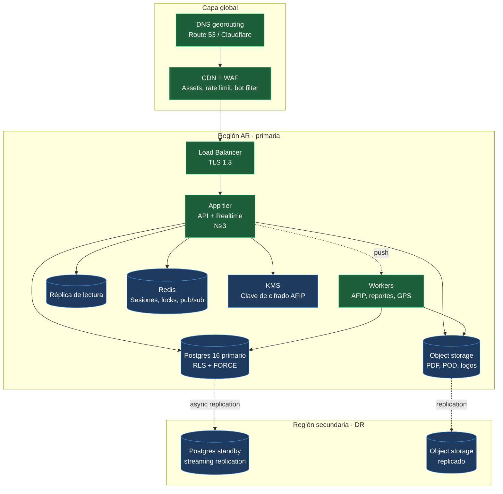
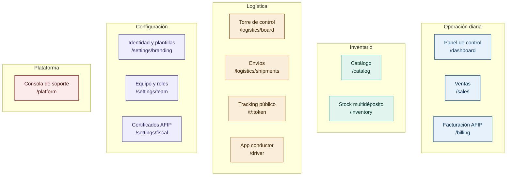
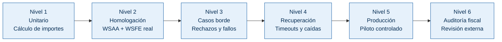
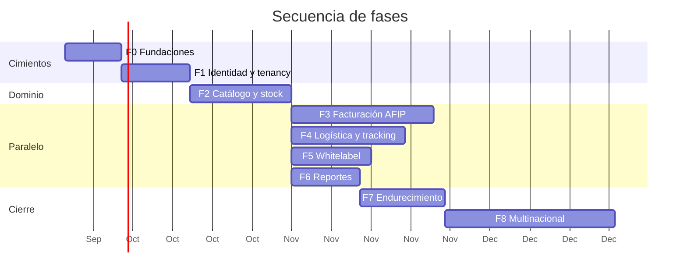

# Plan de Puesta en Producción · Control

**Documento:** Plan de Producción y Escalamiento Multinacional
**Versión:** 1.0
**Fecha:** 18 de septiembre de 2026
**Alcance:** Pasar Control de un prototipo arquitectónico a una plataforma SaaS operando en producción, con capacidad de despliegue en múltiples países.
**Estado base:** Commit `5bc26b3` sobre `main`. Modelo de datos, políticas RLS, servicios AFIP, gateway realtime y motor de exportaciones implementados. Sin renderer de PDF, sin cableado de rutas HTTP, sin suite de tests, sin infraestructura.

---

## Tabla de contenidos

1. [Principios rectores](#1-principios-rectores)
2. [Gobernanza: roles y responsables](#2-gobernanza-roles-y-responsables)
3. [Arquitectura objetivo](#3-arquitectura-objetivo)
4. [Arquitectura de información: una función, una ventana](#4-arquitectura-de-información-una-función-una-ventana)
5. [Fases del plan](#5-fases-del-plan)
6. [Verificación funcional: Facturación AFIP](#6-verificación-funcional-facturación-afip)
7. [Verificación funcional: Envíos y Tracking en tiempo real](#7-verificación-funcional-envíos-y-tracking-en-tiempo-real)
8. [Estándar de calidad profesional](#8-estándar-de-calidad-profesional)
9. [Matriz de pruebas por módulo](#9-matriz-de-pruebas-por-módulo)
10. [Requisitos para despliegue multinacional](#10-requisitos-para-despliegue-multinacional)
11. [Operación: SRE, observabilidad y respuesta](#11-operación-sre-observabilidad-y-respuesta)
12. [Riesgos y mitigaciones](#12-riesgos-y-mitigaciones)
13. [Criterios de aceptación globales](#13-criterios-de-aceptación-globales)
14. [Calendario y dependencias](#14-calendario-y-dependencias)

---

## 1. Principios rectores

Cinco principios gobiernan cada decisión de este plan. Cuando una decisión futura entre en conflicto con ellos, gana el principio.

**1. El aislamiento se verifica, no se asume.** RLS es la barrera, pero una barrera sin test no está probada. Ningún módulo pasa a producción sin su suite de aislamiento corriendo en CI en verde. El día que alguien agregue una tabla y olvide la política, el pipeline lo detiene.

**2. Una función, una ventana.** No existe una pantalla que lo haga todo. Cada capacidad se implementa como una interfaz independiente, con su ruta, su permiso y su propia carga de datos. Un usuario que sólo necesita despachar envíos no debe descargar el módulo de facturación. Esto es una restricción de arquitectura de información, no de estética: impacta el rendimiento percibido, la superficie de error y la posibilidad de dar permisos granulares.

**3. Lo fiscal no se improvisa.** AFIP es un tercero con reglas propias, caídas históricas y una tolerancia cero a la inconsistencia de importes y numeración. Todo el módulo fiscal se valida primero contra homologación, con un plan de contingencia escrito antes de facturar el primer peso real.

**4. Multinacional no es traducir.** Un despliegue en otro país cambia el motor fiscal, la moneda, el formato de documento, la regulación de datos personales y la topología de la infraestructura. Se diseña por abstracción desde el principio, no se adapta después.

**5. Cada fase deja el sistema desplegable.** No hay una fase de "ahora lo hacemos andar". Al final de cada fase el sistema está en verde, con tests, y es desplegable. Si hay que parar, se para con un producto funcional.

---

## 2. Gobernanza: roles y responsables

Los roles se definen por responsabilidad, no por persona. En un equipo chico, una persona puede cubrir varios roles, pero cada rol tiene un único responsable con nombre y apellido. Una tarea con dos responsables no tiene ninguno.

| Código | Rol | Responsabilidad principal | Decide sobre |
|---|---|---|---|
| **ARQ** | Arquitecto de Software Principal | Coherencia de la arquitectura, revisión de ADRs, aprobación de cambios estructurales | Modelo de datos, contratos entre módulos, decisiones irreversibles |
| **BE** | Backend Senior | Servicios de dominio, lógica transaccional, integraciones | Implementación de servicios, optimización de consultas |
| **FE** | Frontend Senior | Aplicación web, sistema de diseño, accesibilidad | Componentes, tokens de marca, arquitectura de estado |
| **FIS** | Especialista Fiscal AFIP | Correctitud de la emisión, relación con AFIP, contingencias | Códigos AFIP, tratamiento de comprobantes, plan de contingencia |
| **DBA** | DBA / SRE de datos | Rendimiento, migraciones, backups, réplica, particionado | Índices, migraciones en producción, estrategia de backup |
| **SRE** | Site Reliability Engineer | Infraestructura, observabilidad, on-call, capacidad | Topología, límites de recursos, SLOs, alertas |
| **SEC** | Seguridad de Aplicaciones | Revisión de aislamiento, pentest, gestión de secretos | Aprobación de gate de seguridad |
| **QA** | QA Lead / Automatización | Estrategia de pruebas, suites de regresión, criterios de aceptación | Aprobación de release, cobertura de pruebas |
| **UX** | Diseño Lead UI/UX | Arquitectura de información, flujos, sistema de diseño | Jerarquía de navegación, plantillas por rubro |
| **PM** | Producto / Líder de proyecto | Alcance, prioridades, coordinación con clientes | Orden de fases, alcance de release |
| **LEG** | Legal / Compliance | Contratos de datos, residencia, términos con AFIP y homologaciones | Países habilitados, DPA, tratamiento de datos personales |

**Regla de escalamiento.** Toda decisión con impacto fiscal, de seguridad o de datos en producción requiere aprobación de **ARQ** y de su especialista (**FIS** o **SEC**). Sin esa doble firma, no entra a la fase.

---

## 3. Arquitectura objetivo

### 3.1 Topología de despliegue



### 3.2 Decisión de arquitectura multinacional: soberanía de datos

Este es el punto que define todo el diseño multinacional, y el que suele decidirse demasiado tarde.

| Modelo | Descripción | Cuándo usarlo |
|---|---|---|
| **Single-region** | Una región sirve a todos los países | Piloto: AR únicamente |
| **Regional con datos soberanos** | Cada país tiene su propia base de datos. La capa de aplicación es compartida. Un usuario de México nunca consulta la base de Argentina | **Recomendado.** Requiere que la sesión fije también el `country_code` y que `withTenant()` valide que el tenant pertenezca a la región de la conexión |
| **Global con réplica de lectura** | Una base global, lecturas regionales | Sólo si la regulación lo permite. Riesgo legal alto con datos fiscales |

**Decisión propuesta: regional con datos soberanos.** Se implementa extendiendo la resolución de contexto: además de `tenant_id`, la sesión fija el **shard regional**. La conexión se toma del pool de la región correcta, y el middleware rechaza cualquier intento de un tenant de operar sobre una región que no es la suya. Reutiliza el mismo patrón de defensa en profundidad que ya existe para tenancy — es una segunda dimensión de aislamiento con la misma forma.

**Impacto en el esquema.** Se agrega `app.tenants.country_code char(2)` y una tabla `platform.regions (code, db_dsn_ref, residency_country, fiscal_driver)`. El `fiscal_driver` apunta al adaptador fiscal del país (ver §10.2).

### 3.3 Stack tecnológico por capa

| Capa | Tecnología | Justificación |
|---|---|---|
| Frontend | Next.js 15 (App Router) + TypeScript + Tailwind + Radix | Server Components reducen el JS enviado; Radix aporta accesibilidad sin imponer estilo |
| Estado servidor | TanStack Query | Cache, reintentos y sincronización sin inventar una capa propia |
| Gráficos | SVG propio + visx | Los tokens de marca ya funcionan en el prototipo; una librería con estilos propios rompe el whitelabel |
| API | Fastify + tRPC + Zod | Tipado extremo a extremo; Zod valida en el borde |
| Realtime | Gateway propio (WS + SSE) | Ya implementado; las librerías genéricas no resuelven el aislamiento por tenant |
| Base de datos | PostgreSQL 16 + PgBouncer | RLS requiere PG 15+ (`security_invoker`); PgBouncer en modo `transaction` |
| Colas | Redis Streams + workers propios | `afip_outbox` ya vive en Postgres; Redis evita dos sistemas de colas |
| Object storage | S3-compatible con cifrado en reposo | PDFs, PODs y logos. Versionado y lifecycle |
| Secretos | KMS + Secrets Manager | La clave de cifrado AFIP nunca toca el repositorio ni el env del contenedor |
| Contenedores | Docker + Kubernetes | Escalado horizontal del app tier y de los workers |
| IaC | Terraform | Infraestructura reproducible por región |

**Atención con PgBouncer y RLS.** En modo `transaction` funciona porque `SET LOCAL` está acotado a la transacción. En modo `session` una conexión se retiene y el contexto puede filtrarse. Esto es una restricción de configuración, no una preferencia: si alguien cambia el pool a modo `session` sin entenderlo, el aislamiento se rompe. Va documentado en el runbook y verificado por un test que inspecciona el modo del pool.

---

## 4. Arquitectura de información: una función, una ventana

### 4.1 Principio de diseño

Cada módulo es una **ventana independiente**: su propia ruta, su propia carga de datos, su propio permiso, su propio bundle. No hay un dashboard monolítico con pestañas que carguen todo.

Consecuencias medibles:
- **Code splitting real.** Un encargado de depósito no descarga el código de facturación.
- **Permisos granulares visibles.** El menú se deriva de `memberships.role_id → role_permissions`, no de condiciones dispersas en el frontend.
- **Aislamiento de fallos.** Si el mapa en vivo se cae, el módulo de facturación sigue operativo.
- **Carga progresiva.** Cada ventana define su propio *critical path*.

### 4.2 Mapa de ventanas



### 4.3 Especificación de ventanas críticas

**W3 · Facturación AFIP** — la ventana de mayor riesgo fiscal.

| Aspecto | Definición |
|---|---|
| Ruta | `/billing` (listado), `/billing/new`, `/billing/[id]` (detalle) |
| Permiso | `billing.read` para ver, `billing.issue_invoice` para emitir |
| Vistas internas | Cola de emisión · Autorizados · Rechazados · Notas de crédito · Libro de IVA |
| Datos propios | Sólo comprobantes. El estado de la conexión AFIP se resuelve en un widget acotado dentro de `/settings/fiscal`, no acá |
| Estados | Emitiendo (optimista con `status='queued'`), autorizado (CAE visible), rechazado (con la observación cruda de AFIP y el código) |
| Acciones bloqueadas | Editar un autorizado. La UI lo oculta y la política RLS lo impide — doble barrera |
| Salida | PDF con identidad de la empresa; exportación XLSX del período |

**W6 · Torre de control** — lectura de alta frecuencia, no de escritura.

| Aspecto | Definición |
|---|---|
| Ruta | `/logistics/board` |
| Permiso | `logistics.read` |
| Datos propios | Mapa en vivo (SSE), contadores por estado, envíos con retraso respecto del SLA |
| Presupuesto de conexión | Una sola conexión SSE para toda la pantalla, multiplexada por envío. **No una conexión por marcador** — con 200 envíos activos, cien operadores abrirían 20.000 conexiones |
| Actualización | Marcadores con movimiento interpolado; los contadores se actualizan por evento, no por *polling* |

**W7 · Envíos** — la ventana de escritura operativa.

| Aspecto | Definición |
|---|---|
| Ruta | `/logistics/shipments` |
| Permiso | `logistics.write` / `logistics.dispatch` |
| Vistas internas | Bandeja de preparación · Despachados · Entregados · Incidencias |
| Acciones | Crear, asignar transportista/vehículo/conductor, cambiar estado con máquina de estados, adjuntar POD |
| Concurrencia | Si dos operadores cambian el mismo envío, gana el primero y el segundo recibe un aviso con el estado actual. Bloqueo optimista por `updated_at` |

**W8 · Tracking público** — sin sesión, la ventana de mayor exposición.

| Aspecto | Definición |
|---|---|
| Ruta | `/t/:token` |
| Autenticación | Token de 32 bytes, hasheado, con expiración. Nunca el UUID del envío |
| Contenido | Timeline, estado actual, fecha estimada, comprobante si está autorizado |
| Datos expuestos | Mínimos: código de seguimiento, estado, destino parcial, timeline. **Sin precios, sin datos fiscales del receptor, sin datos de otros envíos** |
| Rate limit | Por token y por IP. El token es la única credencial, así que el endpoint es el más atacado |
| Prohibición | No debe permitir inferir la existencia de otros envíos cambiando el token |

**W13 · Consola de plataforma** — separada de la aplicación de negocio.

| Aspecto | Definición |
|---|---|
| Ruta | `/platform` (dominio distinto) |
| Permiso | Rol `control_platform`. Un owner de empresa **nunca** accede |
| Funciones | Alta de empresas, estado de suscripción, impersonación **auditada**, diagnóstico de integración AFIP |
| Impersonación | Todo acto bajo impersonación se registra con `actor_kind='platform'` y el usuario real. La sesión impersonada expira en 30 minutos |
| Aislamiento | Entra al inquilino con `platform_admin` en el contexto, lo que **se registra siempre** en `audit.events`. No hay acceso silencioso |

### 4.4 Reglas de arquitectura de información

| # | Regla | Verificación |
|---|---|---|
| A1 | Toda ventana declara su permiso requerido en un único lugar (el mapa de rutas) | Test que recorre el mapa y verifica que cada ruta tenga guard |
| A2 | El menú se genera desde los permisos del usuario, no desde una lista estática | Test: un usuario `warehouse` no ve el ítem de facturación |
| A3 | Ninguna ventana carga datos de un módulo que no es el suyo | Revisión de dependencias en el código |
| A4 | Los módulos opcionales respetan `tenants.features` | Test: con `logistics.enabled=false`, la ruta responde 404 y el ítem no aparece |
| A5 | Toda ventana tiene estado vacío, de carga y de error explícitos | Checklist de revisión de UI |
| A6 | Ninguna ventana supera los 3 niveles de navegación desde el menú raíz | Revisión de UX |
| A7 | Las ventanas de sólo lectura no renderizan controles de escritura, ni deshabilitados | Revisión de UX |

---

## 5. Fases del plan

Nueve fases. Cada una tiene entregable, responsables, criterios de aceptación y **gate** de salida. Un gate no se negocia: si no pasa, la fase no cierra.

### Resumen

| Fase | Nombre | Días | Responsable principal | Gate de salida |
|---|---|---|---|---|
| **F0** | Fundaciones y entorno | 10 | ARQ + SRE | Pipeline con tests de aislamiento en verde |
| **F1** | Identidad y tenancy productivo | 12 | BE + SEC | Auditoría de aislamiento externa aprobada |
| **F2** | Catálogo, stock y ventas | 18 | BE + FE | Reconciliación de stock sin diferencias |
| **F3** | Facturación AFIP | 25 | FIS + BE | 200 comprobantes en homologación sin discrepancias |
| **F4** | Logística y tracking | 20 | BE + FE | Latencia p95 < 1 s con 500 envíos concurrentes |
| **F5** | Whitelabel y ventanas por rubro | 14 | FE + UX | 5 plantillas validadas con 5 clientes reales |
| **F6** | Reportes y exportaciones | 12 | BE + FE | XLSX de 50.000 filas sin degradar memoria |
| **F7** | Endurecimiento y ensayo de producción | 15 | SRE + SEC | Simulacro de desastre con RTO cumplido |
| **F8** | Multinacionalización | 30 | ARQ + LEG | Segundo país emitiendo comprobantes válidos |
| **F9** | Operación y mejora continua | continuo | SRE | SLOs sostenidos 30 días |

---

### F0 · Fundaciones y entorno

**Objetivo.** Que el equipo pueda trabajar y que nada llegue a producción sin verificación automática.

**Responsable principal:** ARQ. **Apoyan:** SRE, QA, DBA.

**Actividades**

| # | Actividad | Responsable |
|---|---|---|
| F0.1 | Estructura del monorepo: workspace, paquetes compartidos, convenciones | ARQ |
| F0.2 | TypeScript en modo estricto, ESLint y Prettier con reglas acordadas | BE + FE |
| F0.3 | Pipeline de CI: lint, typecheck, build, tests unitarios | SRE |
| F0.4 | **Suite de aislamiento multi-tenant** que recorre el catálogo de tablas y verifica cada par de inquilinos | SEC + QA |
| F0.5 | Runner de migraciones con versionado, checksum y rollback documentado | DBA |
| F0.6 | Docker Compose local: Postgres 16, Redis, storage S3-compatible | SRE |
| F0.7 | Entornos: local, CI, homologación, producción | SRE |
| F0.8 | Gestión de secretos: KMS, plantilla de variables, prohibición de secretos en el repo | SEC |
| F0.9 | ADRs: plantilla y los cinco primeros decisiones ya tomadas | ARQ |

**La actividad F0.4 es la más importante de la fase.** La suite no prueba casos escritos a mano: descubre las tablas consultando el catálogo con `tenant_id`, genera un caso por tabla, y verifica cuatro invariantes:

1. El inquilino A lee sólo datos de A.
2. El inquilino A **no puede** leer datos de B.
3. El inquilino A **no puede** escribir con `tenant_id` de B.
4. Sin contexto de sesión, toda tabla devuelve **cero filas**.

El cuarto invariante es el que se olvida y el que más importa: es la garantía de que un fallo en la resolución de contexto niega el acceso en vez de abrirlo.

**Criterios de aceptación**

| ID | Criterio | Verificación |
|---|---|---|
| F0-AC1 | El pipeline corre en menos de 10 minutos | Medición en CI |
| F0-AC2 | Un PR con una tabla nueva sin política RLS **falla** el pipeline | Test negativo: se introduce a propósito y se verifica el fallo |
| F0-AC3 | Las 35+ tablas con `tenant_id` están cubiertas por la suite | Reporte de cobertura de la suite |
| F0-AC4 | El aislamiento se verifica en cada push, no sólo antes de release | Configuración de CI |
| F0-AC5 | Un desarrollador nuevo levanta el entorno en menos de 30 minutos | Prueba real con un integrante nuevo |

---

### F1 · Identidad y tenancy productivo

**Objetivo.** Autenticación federada funcionando, sesiones seguras y aislamiento verificado por un tercero.

**Responsable principal:** BE. **Apoyan:** SEC, SRE, QA.

**Actividades**

| # | Actividad | Responsable |
|---|---|---|
| F1.1 | Google OAuth con PKCE, validación completa del `id_token` contra JWKS | BE |
| F1.2 | Sesiones en Redis con rotación, `HttpOnly`, `Secure`, `SameSite` | BE + SEC |
| F1.3 | Resolución de membresías y permisos al iniciar sesión | BE |
| F1.4 | Middleware de tenancy cableado a rutas reales | BE |
| F1.5 | Rate limiting por IP y por usuario en endpoints de autenticación | SEC |
| F1.6 | Registro de eventos de seguridad con severidad y alerta | SEC |
| F1.7 | Alta de empresa, invitación de usuarios, aceptación de invitación | BE + FE |
| F1.8 | **Auditoría externa de aislamiento** | SEC |
| F1.9 | Onboarding: crear empresa, cargar branding, invitar equipo | FE + UX |

**Criterios de aceptación**

| ID | Criterio | Verificación |
|---|---|---|
| F1-AC1 | Un `id_token` con `aud` incorrecto es rechazado | Test con token de otra aplicación |
| F1-AC2 | Un `id_token` firmado con clave ajena es rechazado | Test con JWKS falso |
| F1-AC3 | Un `X-Tenant-Id` que difiere de la sesión se ignora y se registra como crítico | Test + verificación en `audit.events` |
| F1-AC4 | La sesión impersonada expira en 30 minutos | Test de expiración |
| F1-AC5 | **La auditoría externa no encuentra hallazgos críticos ni altos abiertos** | Informe de auditoría firmado |
| F1-AC6 | Un usuario desactivado pierde acceso en menos de 60 segundos | Test de revocación |
| F1-AC7 | El cambio de empresa revalida la membresía en el servidor | Test con membresía revocada |

**Gate F1.** Sin el informe de auditoría externa (F1-AC5) aprobado, la fase no cierra. El aislamiento multi-tenant es la promesa central del producto: no se autoevalúa.

---

### F2 · Catálogo, stock y ventas

**Objetivo.** Operación comercial completa, con inventario consistente y auditable.

**Responsable principal:** BE. **Apoyan:** FE, DBA, QA.

**Actividades**

| # | Actividad | Responsable |
|---|---|---|
| F2.1 | CRUD de catálogo: productos, variantes, categorías, marcas | BE + FE |
| F2.2 | Listas de precios y múltiples monedas con tipo de cambio | BE |
| F2.3 | Depósitos y configuración de depósito primario | BE + FE |
| F2.4 | Movimientos de stock vía `apply_stock_movement` (ya implementado) | BE |
| F2.5 | Transferencias entre depósitos con recepción y diferencias | BE + FE |
| F2.6 | Órdenes de venta, reserva de stock, confirmación | BE + FE |
| F2.7 | **Job de reconciliación** `stock_levels` vs. suma de `stock_movements` | DBA + BE |
| F2.8 | Importación masiva de catálogo desde XLSX | BE + FE |
| F2.9 | Ventanas: `/catalog`, `/inventory`, `/sales` con sus permisos | FE |
| F2.10 | Concurrencia: bloqueo optimista en edición de órdenes | BE |

**Criterios de aceptación**

| ID | Criterio | Verificación |
|---|---|---|
| F2-AC1 | **La reconciliación no encuentra diferencias** tras 10.000 movimientos sintéticos | Job en verde |
| F2-AC2 | Un ajuste que dejaría stock negativo es rechazado con mensaje claro | Test de constraint |
| F2-AC3 | Dos ventas simultáneas de la última unidad: una gana, la otra falla limpiamente | Test de concurrencia |
| F2-AC4 | Una transferencia con recepción parcial registra la diferencia sin ajustarla en silencio | Test funcional |
| F2-AC5 | La importación de 20.000 filas completa sin agotar memoria | Prueba de carga |
| F2-AC6 | Cada ventana responde en menos de 300 ms p95 con 100.000 productos | Prueba de rendimiento |

---

### F3 · Facturación AFIP

**Objetivo.** Emitir comprobantes electrónicos válidos, con recuperación ante fallos y plan de contingencia.

**Responsable principal:** FIS. **Apoyan:** BE, QA, LEG, SRE.

Verificación funcional detallada en [§6](#6-verificación-funcional-facturación-afip).

**Criterios de aceptación**

| ID | Criterio | Verificación |
|---|---|---|
| F3-AC1 | 200 comprobantes emitidos en homologación sin discrepancias de importe | Informe de FIS |
| F3-AC2 | La suma de `invoice_taxes` cuadra con `invoices.tax_total` en el 100% de los casos | Consulta de verificación |
| F3-AC3 | `ImpTotal = ImpNeto + ImpIVA` se valida antes de enviar y bloquea el envío si falla | Test unitario |
| F3-AC4 | Un timeout seguido de `FECompConsultar` recupera el CAE existente sin duplicar | Test de inyección de fallo |
| F3-AC5 | Un reintento con la misma `idempotency_key` no crea un segundo comprobante | Test de idempotencia |
| F3-AC6 | Un comprobante autorizado **no puede** ser modificado por ninguna ruta | Test de política RLS |
| F3-AC7 | La Nota de Crédito referencia correctamente el comprobante origen | Test funcional |
| F3-AC8 | El plan de contingencia está escrito, probado y aprobado por FIS y LEG | Documento firmado |
| F3-AC9 | Con AFIP caído, los comprobantes se encolan y se emiten al recuperar | Simulacro con AFIP bloqueado |
| F3-AC10 | El certificado vencido se detecta **antes** de intentar emitir | Test con cert vencido |

---

### F4 · Logística y tracking

**Objetivo.** Operación logística con trazabilidad en tiempo real, tolerante a la desconexión.

**Responsable principal:** BE. **Apoyan:** FE, SRE, QA.

Verificación funcional detallada en [§7](#7-verificación-funcional-envíos-y-tracking-en-tiempo-real).

**Criterios de aceptación**

| ID | Criterio | Verificación |
|---|---|---|
| F4-AC1 | **Latencia p95 < 1 s** entre el cambio de estado y su recepción en el navegador | Medición con 500 envíos concurrentes |
| F4-AC2 | Un operador sólo recibe eventos de su empresa | Test de aislamiento en realtime |
| F4-AC3 | Suscribirse al envío de otra empresa se rechaza y se registra como crítico | Test negativo |
| F4-AC4 | Una transición inválida (`delivered` → `in_transit`) es rechazada | Test de máquina de estados |
| F4-AC5 | La app del conductor sincroniza 500 eventos acumulados offline sin duplicar | Test con `client_event_id` repetido |
| F4-AC6 | Un cliente lento se desconecta con código 1013 en lugar de acumular buffer | Test de backpressure |
| F4-AC7 | El link de tracking expirado devuelve un mensaje claro, no un error genérico | Test funcional |
| F4-AC8 | El token de tracking no permite enumerar otros envíos | Test de seguridad |
| F4-AC9 | Reconexión automática del SSE sin perder eventos intermedios | Test de reconexión |
| F4-AC10 | Una entrega con reservas pasa a `incident`, no a `delivered` | Test funcional |

---

### F5 · Whitelabel y ventanas por rubro

**Objetivo.** Cada empresa ve su identidad y su plantilla; cada rubro tiene su jerarquía de información.

**Responsable principal:** FE. **Apoyan:** UX, BE.

| ID | Criterio | Verificación |
|---|---|---|
| F5-AC1 | Cambiar el color corporativo se refleja en toda la UI **sin redesplegar** | Test funcional |
| F5-AC2 | Los PDFs salen con logo, colores y membrante de la empresa | Revisión visual |
| F5-AC3 | Un color de marca con contraste insuficiente se corrige automáticamente a AA | Test de contraste WCAG |
| F5-AC4 | Un membrante con `<script>` o `onerror` es neutralizado | Test del sanitizador |
| F5-AC5 | Las 5 plantillas se validan con 5 clientes reales de rubros distintos | Feedback documentado |
| F5-AC6 | La UI es usable a 360 px de ancho | Revisión en dispositivos |
| F5-AC7 | Navegación completa por teclado, foco visible | Auditoría de accesibilidad |
| F5-AC8 | Contraste AA verificado en las 5 plantillas | Axe sin violaciones |

---

### F6 · Reportes y exportaciones

**Responsable principal:** BE. **Apoyan:** FE, FIS.

| ID | Criterio | Verificación |
|---|---|---|
| F6-AC1 | XLSX de 50.000 filas sin superar 512 MB de memoria | Medición de proceso |
| F6-AC2 | El XLSX abre sin advertencias en Excel y LibreOffice | Prueba en ambas aplicaciones |
| F6-AC3 | Los formatos numéricos y de fecha son correctos en configuración regional es-AR | Revisión manual |
| F6-AC4 | El PDF respeta la orientación y pagina correctamente | Revisión visual |
| F6-AC5 | **El total del reporte coincide con la consulta fuente** | Test de reconciliación |
| F6-AC6 | El pie incluye usuario y timestamp de generación | Revisión |
| F6-AC7 | Un reporte de 50.000 filas termina en menos de 60 s | Prueba de rendimiento |
| F6-AC8 | El reporte respeta RLS: no incluye datos de otras empresas | Test de aislamiento |

**F6-AC5 es el criterio que no se puede omitir.** Un reporte de facturación que no cuadra con la base genera una crisis de confianza con el cliente, y es el defecto más difícil de detectar porque el reporte *se ve* bien.

---

### F7 · Endurecimiento y ensayo de producción

**Responsable principal:** SRE. **Apoyan:** SEC, DBA, QA, FIS.

**Actividades**

| # | Actividad | Responsable |
|---|---|---|
| F7.1 | Pentest externo sobre aplicación, API y realtime | SEC |
| F7.2 | Pruebas de carga hasta 3× la capacidad estimada | SRE |
| F7.3 | **Simulacro de desastre**: pérdida de la base primaria y recuperación | SRE + DBA |
| F7.4 | Verificación de restauración de backups con integridad | DBA |
| F7.5 | Runbooks: incidentes, AFIP caído, degradación, escalado | SRE |
| F7.6 | Alertas y guardias definidas con escalamiento | SRE |
| F7.7 | Prueba de *failover* de la réplica a primario | DBA |
| F7.8 | Revisión de configuración de producción contra checklist de seguridad | SEC |
| F7.9 | Plan de rollback por release | SRE |
| F7.10 | Migración de datos reales en seco (piloto con un cliente) | DBA + PM |

| ID | Criterio | Verificación |
|---|---|---|
| F7-AC1 | **RTO ≤ 1 hora, RPO ≤ 5 minutos** verificados en simulacro | Medición del ejercicio |
| F7-AC2 | El pentest no deja hallazgos críticos ni altos abiertos | Informe firmado |
| F7-AC3 | El sistema sostiene 3× la carga objetivo sin degradar el p95 | Prueba de carga |
| F7-AC4 | La restauración de backup produce una base íntegra | Verificación con consultas |
| F7-AC5 | Todo incidente tipo tiene runbook | Revisión de cobertura |
| F7-AC6 | El rollback de un release se ejecuta en menos de 15 minutos | Simulacro |
| F7-AC7 | El piloto real emite comprobantes en producción sin incidencias | Reporte del piloto |

---

### F8 · Multinacionalización

Ver [§10](#10-requisitos-para-despliegue-multinacional). **Responsable principal:** ARQ. **Apoyan:** LEG, FIS, SRE, BE.

| ID | Criterio | Verificación |
|---|---|---|
| F8-AC1 | Un tenant de otro país opera sin afectar a los de Argentina | Test de aislamiento regional |
| F8-AC2 | El motor fiscal es intercambiable por configuración, sin tocar el dominio | Revisión de arquitectura |
| F8-AC3 | El segundo país emite documentos válidos ante su autoridad | Validación con la autoridad local |
| F8-AC4 | Los datos de cada país residen en su región | Auditoría de almacenamiento |
| F8-AC5 | Ninguna consulta cruza la frontera regional | Test de aislamiento por shard |
| F8-AC6 | El formato de documento y la moneda son correctos por país | Revisión de FIS local |
| F8-AC7 | La normativa de datos personales de cada país está cumplida | Informe de LEG |

---

### F9 · Operación y mejora continua

**Responsable:** SRE. Sin fecha de fin.

| ID | Criterio | Verificación |
|---|---|---|
| F9-AC1 | Disponibilidad ≥ 99.9% mensual | Medición de SLO |
| F9-AC2 | p95 de API < 400 ms | Medición continua |
| F9-AC3 | Tasa de error < 0.1% | Medición continua |
| F9-AC4 | MTTR < 30 minutos para incidentes críticos | Registro de incidentes |
| F9-AC5 | Cero incidentes de fuga de datos entre inquilinos | Registro de seguridad |
| F9-AC6 | SLOs sostenidos 30 días consecutivos | Reporte mensual |
| F9-AC7 | Post-mortem sin culpa en todo incidente crítico | Proceso auditado |

---

## 6. Verificación funcional: Facturación AFIP

### 6.1 Estrategia de validación

La validación del módulo fiscal es gradual y no saltea etapas. Cada nivel agrega confianza y ninguno se puede omitir.



### 6.2 Batería de casos funcionales

Cada caso de esta batería se ejecuta en homologación y queda registrado con su CAE de prueba.

**Grupo A · Emisión básica**

| # | Caso | Resultado esperado |
|---|---|---|
| A1 | Factura A, Responsable Inscripto, bienes, IVA 21% | CAE de 14 dígitos, `Resultado='A'` |
| A2 | Factura B, Consumidor Final, IVA 21% | CAE válido, `CondicionIVAReceptorId=5` |
| A3 | Factura B, Monotributo | CAE válido, `CondicionIVAReceptorId=6` |
| A4 | Factura C, IVA 0%, emisor Monotributista | CAE válido, sin discriminación de IVA |
| A5 | Factura A, Exento | CAE válido, `CondicionIVAReceptorId=4` |

**Grupo B · Alícuotas y composición**

| # | Caso | Resultado esperado |
|---|---|---|
| B1 | Ítems con IVA 21% y 10,5% mezclados | Array `Iva` con dos elementos, bases correctas |
| B2 | Ítem con IVA 0% | **El array `Iva` NO incluye el Id 3** |
| B3 | Ítems con 27% | Array con `Id=6` |
| B4 | Descuento por línea del 15% | Base imponible reducida, IVA recalculado sobre el neto |
| B5 | Comprobante con operaciones exentas | `ImpOpEx` con importe, `ImpNeto` sin incluirlas |

**Grupo C · Invariantes de importe** — los que AFIP rechaza si fallan

| # | Caso | Resultado esperado |
|---|---|---|
| C1 | 3 × $1.005,00 con IVA 21% | Redondeo correcto al centavo; `ImpTotal` cuadra |
| C2 | 1 × $0,01 | No falla por importe mínimo |
| C3 | 100 ítems | `ImpTotal = ImpNeto + ImpIVA` sin desvío |
| C4 | Importe con 4 decimales de entrada | Se redondea a 2 antes de enviar, sin acumular error |
| C5 | Total que difiere en 1 centavo por composición | **Bloqueado antes de enviar**, con el detalle de la diferencia |

**Grupo D · Concepto y fechas**

| # | Caso | Resultado esperado |
|---|---|---|
| D1 | Concepto = Productos (1) | Sin `FchServDesde/Hasta` |
| D2 | Concepto = Servicios (2) | Con `FchServDesde`, `FchServHasta`, `FchVtoPago` |
| D3 | Servicios sin fechas | **Rechazado localmente** antes de llamar a AFIP |
| D4 | Servicios con `FchServDesde` posterior a `FchServHasta` | Rechazado localmente con mensaje claro |

**Grupo E · Documento del receptor**

| # | Caso | Resultado esperado |
|---|---|---|
| E1 | Factura A con CUIT de 11 dígitos | Aceptado |
| E2 | Factura A con CUIT de 10 dígitos | **Rechazado por constraint de la tabla** |
| E3 | Factura B a Consumidor Final | `DocTipo=99`, `DocNro=0` |
| E4 | Factura B con DNI | `DocTipo=96`, número correcto |
| E5 | Factura A a Consumidor Final | **Rechazado** (regla `inv_doc_type_rules`) |

**Grupo F · Notas de crédito y débito**

| # | Caso | Resultado esperado |
|---|---|---|
| F1 | NC-A sobre Factura A | `CbtesAsoc` con el comprobante origen |
| F2 | NC sin comprobante asociado | **Rechazado** por constraint |
| F3 | NC-A sobre Factura B | Rechazado por regla de tipo |
| F4 | NC por anulación total | Importe igual al original, en negativo |
| F5 | NC parcial | Importe menor al original |

**Grupo G · Correlatividad**

| # | Caso | Resultado esperado |
|---|---|---|
| G1 | Primera emisión del punto de venta | Número 1 o el que indique AFIP |
| G2 | Emisión consecutiva | Incremento sin huecos |
| G3 | AFIP devuelve un número mayor al local | Se adopta el de AFIP |
| G4 | Reintento tras fallo local | **No reutiliza** el número quemado |
| G5 | Dos emisiones concurrentes al mismo punto de venta | Números distintos, sin colisión |

**Grupo H · Rechazos y recuperación**

| # | Caso | Resultado esperado |
|---|---|---|
| H1 | AFIP responde `Resultado='R'` | Estado `rejected`, observación cruda guardada |
| H2 | Error 10016 (número no autorizado) | Se resincroniza desde `FECompUltimoAutorizado` y se reintenta |
| H3 | Timeout de 30 s | `FECompConsultar`; si existe, se persiste el CAE |
| H4 | Timeout sin comprobante en AFIP | Se reintenta con el mismo número |
| H5 | WSAA caído | Se reintenta con backoff, sin perder el comprobante |
| H6 | Certificado vencido | Bloqueo previo con mensaje accionable |
| H7 | Par CRT/KEY no correspondiente | Bloqueo previo, no llega a AFIP |
| H8 | Servicio `wsfe` no habilitado en el CUIT | Error clasificado con la causa y el pasos a seguir |

### 6.3 Verificación de consistencia fiscal

Estas consultas se ejecutan como control de calidad durante todo el piloto. Un hallazgo significa detener la facturación y revisar.

```sql
-- 1. Coherencia de totales por comprobante
SELECT count(*) AS inconsistentes
FROM billing.invoices
WHERE status = 'authorized'
  AND abs(total - (subtotal - discount_total + tax_total)) > 0.01;

-- 2. Coherencia entre cabecera y desglose de IVA
SELECT i.id, i.tax_total, sum(t.tax_amount) AS suma_lineas
FROM billing.invoices i
JOIN billing.invoice_taxes t ON t.invoice_id = i.id
WHERE i.status = 'authorized'
GROUP BY i.id, i.tax_total
HAVING abs(i.tax_total - sum(t.tax_amount)) > 0.01;

-- 3. Coherencia entre cabecera y líneas
SELECT i.id
FROM billing.invoices i
JOIN billing.invoice_items it ON it.invoice_id = i.id
WHERE i.status = 'authorized'
GROUP BY i.id, i.total
HAVING abs(i.total - sum(it.total_amount)) > 0.01;

-- 4. Autorizados sin CAE (no debería existir jamás)
SELECT count(*) FROM billing.invoices
WHERE result = 'approved' AND cae IS NULL;

-- 5. Huecos en la numeración por punto de venta
SELECT point_of_sale, doc_type,
       min(number) AS primero, max(number) AS ultimo, count(*) AS emitidos
FROM billing.invoices
WHERE status = 'authorized'
GROUP BY point_of_sale, doc_type
HAVING count(*) <> max(number) - min(number) + 1;
```

La consulta 5 merece una nota: **huecos puede haberlos** cuando un comprobante se rechaza después de reservar el número. Lo que no puede haber es un hueco inexplicable. El resultado se contrasta contra `billing.afip_request_log` para confirmar que cada hueco corresponde a un intento fallido registrado.

### 6.4 Plan de contingencia ante caída de AFIP

Este documento se escribe y se aprueba (F3-AC8) **antes** de facturar el primer comprobante real.

| Escenario | Acción | Responsable |
|---|---|---|
| AFIP no responde por más de 30 minutos | Activar modo contingencia: los comprobantes se emiten en papel o por otro medio y se registran localmente | FIS + operación |
| AFIP responde con error de servicio | Los comprobantes quedan en `afip_outbox` con backoff exponencial; se reintentan automáticamente | SRE |
| Caída mayor a 24 horas | Activación del régimen de contingencia según normativa vigente, con registro de cada comprobante para su posterior informatización | FIS + LEG |
| Recuperación de AFIP | Informatización de los comprobantes emitidos en contingencia, conciliación y verificación de correlatividad | FIS |
| Certificado vencido sin renovación | Detección temprana por alerta a 45, 30 y 15 días; bloqueo de emisión al vencer | SRE + FIS |

**Alerta preventiva de certificados.** Una tarea programada verifica diariamente `cert_not_after` de todas las empresas y alerta a 45, 30 y 15 días. Un certificado vencido sin aviso es un negocio que no puede facturar, y la causa se ve como un error genérico de AFIP.

### 6.5 Responsables de la verificación fiscal

| Actividad | Responsable | Aprueba |
|---|---|---|
| Batería de casos en homologación | QA + FIS | FIS |
| Revisión de códigos AFIP contra catálogos oficiales | FIS | FIS |
| Verificación de consistencia en el piloto | FIS | FIS + ARQ |
| Plan de contingencia | FIS + SRE | FIS + LEG |
| Auditoría fiscal externa | Auditor externo | LEG |
| Certificación de homologación previa a producción | FIS | ARQ + PM |

---

## 7. Verificación funcional: Envíos y Tracking en tiempo real

### 7.1 Casos funcionales: gestión de envíos

| # | Caso | Resultado esperado |
|---|---|---|
| E1 | Crear envío desde una orden de venta | Envío en `draft`, con ítems y destino copiados |
| E2 | Asignar transportista, vehículo y conductor | Asignación registrada, conductor ve el envío en su app |
| E3 | Transición `draft → preparing → ready` | Timeline con timestamps correctos |
| E4 | Despachar (`ready → in_transit`) | `dispatched_at` seteado, stock descontado |
| E5 | Marcar `out_for_delivery` | Evento publicado, cliente notificado |
| E6 | Entregar con POD completo | `delivered`, firma y fotos almacenadas |
| E7 | Entregar con reservas | Pasa a `incident`, con la discrepancia registrada |
| E8 | Reportar incidencia desde `in_transit` | Estado `incident`, motivo registrado |
| E9 | Reprogramar desde `incident` | Vuelve a `preparing` con nota |
| E10 | **Intentar `delivered → in_transit`** | **Rechazado** con error claro |
| E11 | Envío multi-parada | Paradas secuenciadas, estados por parada |
| E12 | Entrega parcial | `qty_delivered` y `qty_rejected` por ítem |
| E13 | Cancelar desde `preparing` | Estado `cancelled`, stock liberado |
| E14 | **Intentar cancelar desde `delivered`** | **Rechazado** (estado terminal) |
| E15 | Reenviar el mismo evento desde la app | Deduplicado por `client_event_id` |

### 7.2 Casos funcionales: tracking en tiempo real

| # | Caso | Resultado esperado |
|---|---|---|
| T1 | Un operador ve el envío cambiar de estado | Actualización en menos de 1 s |
| T2 | El mapa muestra la posición del conductor | Marcador actualizado por `position_pings` |
| T3 | 100 envíos activos en una pantalla | Una conexión SSE multiplexada, no 100 |
| T4 | El cliente abre su link de tracking | Timeline correcto, sin exponer precios |
| T5 | El cliente confirma la descarga | Estado `delivered`, POD registrado |
| T6 | El cliente confirma con reservas | Estado `incident`, discrepancia registrada |
| T7 | El link expira | Mensaje claro y accionable |
| T8 | El cliente reconecta tras perder señal | Sin perder eventos intermedios |
| T9 | Dos operadores ven el mismo envío | Ambos reciben la misma actualización |
| T10 | El operador A de la empresa X no ve los envíos de Y | **Cero eventos cruzados** |
| T11 | Suscribirse al envío de otra empresa | Rechazado y registrado como crítico |
| T12 | El conductor permanece 10 minutos sin señal y luego sincroniza | Eventos ordenados por `occurred_at`, sin duplicados |
| T13 | El conductor envía 500 pings de GPS | Persistidos en `position_pings`, sin saturar el timeline |
| T14 | Cliente con red muy lenta | Desconectado con 1013, sin degradar a los demás |
| T15 | Caída del gateway realtime | Los clientes reconectan solos; el estado se recupera del timeline |

### 7.3 Pruebas de carga y latencia

| Escenario | Carga | Criterio |
|---|---|---|
| Operadores concurrentes | 200 con tablero abierto | p95 < 1 s, sin errores |
| Envíos activos por tablero | 500 | Render bajo 200 ms |
| Pings de GPS | 5.000 por minuto | Sin pérdida, sin saturación de escritura |
| Clientes finales en tracking | 2.000 simultáneos | p95 < 500 ms |
| Sincronización offline | 500 eventos en una sincronización | Sin duplicados, orden correcto |
| Duración | 4 horas sostenidas | Sin fuga de memoria ni de conexiones |

La última fila es la que más defectos descubre. Las fugas de conexiones y de memoria aparecen con el tiempo, no en una prueba de cinco minutos.

### 7.4 Matriz de aislamiento en realtime

Esta matriz se ejecuta completa en cada release. Es la contraparte de la suite de aislamiento de base de datos, aplicada al canal en vivo.

| # | Escenario | Resultado esperado |
|---|---|---|
| R1 | Operador de X intenta suscribirse a un envío de Y | Rechazado; evento crítico registrado |
| R2 | Operador de X recibe eventos del bus de Y | **Ninguno**, verificado por canal separado |
| R3 | Conductor de X recibe asignaciones de Y | Ninguna |
| R4 | Token de tracking de un envío de Y usado en X | Rechazado |
| R5 | Cliente final de un envío no ve otros envíos del mismo cliente | Sólo su envío |
| R6 | Un empleado despedido con sesión activa | Pierde el acceso en menos de 60 s |
| R7 | Manipulación del `shipmentId` en una suscripción | Revalidado contra la base de datos; rechazado |
| R8 | Evento publicado a un tenant sin suscriptores | Sin error, sin efectos |
| R9 | Impersonación desde la consola de plataforma | Registrada con actor real; expira en 30 min |
| R10 | Recarga de la conexión durante un cambio de estado | Sin pérdida ni duplicación del evento |

### 7.5 Responsables de la verificación logística

| Actividad | Responsable | Aprueba |
|---|---|---|
| Casos funcionales de envíos | QA | QA |
| Casos de tracking en tiempo real | QA | BE + SRE |
| Pruebas de carga y latencia | SRE | ARQ |
| Matriz de aislamiento en realtime | SEC | SEC |
| Prueba con flota real (piloto) | PM + operación | PM |
| Certificación de la app del conductor | QA | BE |

---

## 8. Estándar de calidad profesional

### 8.1 Definición de "terminado"

Una funcionalidad está terminada cuando cumple las doce condiciones siguientes. No once. No "casi todas".

| # | Condición | Evidencia |
|---|---|---|
| 1 | Implementada según la especificación | Revisión de código |
| 2 | Con tests unitarios de la lógica de negocio | Cobertura ≥ 80% en el módulo |
| 3 | Con tests de integración del flujo completo | Al menos un caso *happy path* y uno de error |
| 4 | Con test de aislamiento multi-tenant | En la suite de aislamiento |
| 5 | Con validación de entrada en el borde | Esquema Zod en el contrato |
| 6 | Con manejo explícito de errores y mensajes accionables | Revisión de UI y de API |
| 7 | Con estados de carga, vacío y error en la UI | Revisión de UX |
| 8 | Con logs estructurados y métricas | Verificación en observabilidad |
| 9 | Con documentación de la API actualizada | Contrato publicado |
| 10 | Con revisión de código aprobada por un par | PR aprobado |
| 11 | Con verificación de accesibilidad | Axe sin violaciones |
| 12 | Sin deuda técnica registrada como bloqueante | Backlog revisado |

### 8.2 Estándares técnicos

**Código**
- TypeScript en modo estricto. `any` prohibido sin justificación escrita en el propio código.
- Guardas de exhaustividad con `never` en todo `switch` sobre uniones.
- Funciones de dominio puras y testeables; los efectos secundarios aislados en la capa de servicio.
- Complejidad ciclomática máxima por función: 10.
- Sin dependencias nuevas sin evaluación de tamaño, licencia y mantenimiento.

**Base de datos**
- Toda migración es idempotente y envuelta en transacción.
- Toda tabla nueva con `tenant_id` se verifica contra la suite de aislamiento **en el mismo PR**.
- Toda vista lleva `security_invoker = true`.
- Ningún índice sin justificación por consulta real.
- Sin `SELECT *` en código de producción.
- Toda consulta en ruta crítica tiene su `EXPLAIN ANALYZE` revisado.

**API**
- Contrato tipado y versionado (`/api/v1`).
- Validación de entrada en el borde, siempre.
- Errores con código estable, mensaje para el usuario y `requestId`.
- *Idempotencia* en toda operación que crea un recurso con efecto externo.
- Rate limiting por usuario y por endpoint sensible.

**Frontend**
- Server Components por defecto; `use client` sólo donde hace falta interactividad.
- Presupuesto: JS inicial por ventana < 200 KB comprimido.
- LCP < 2,5 s en 4G; CLS < 0,1; INP < 200 ms.
- Sin colores literales; todo pasa por tokens de marca.
- Navegación por teclado completa y foco visible siempre.

**Seguridad**
- Validación de entrada en cada borde.
- Consultas parametrizadas, siempre.
- Secretos en KMS, nunca en el repositorio ni en variables de imagen.
- Dependencias escaneadas en CI.
- Revisión de seguridad obligatoria para todo cambio en autenticación, autorización o acceso a datos.

**Observabilidad**
- Logs estructurados en JSON con `requestId`, `tenantId` y `userId`.
- Nunca loguear datos sensibles: CRT/KEY, tokens, datos fiscales completos.
- Trazas distribuidas en las rutas críticas.
- Toda operación de negocio relevante emite una métrica.

### 8.3 SLOs comprometidos

| Indicador | Objetivo | Ventana | Consecuencia de incumplir |
|---|---|---|---|
| Disponibilidad | 99,9% | Mensual | Revisión de arquitectura; freeze de features |
| p95 de API | < 400 ms | Semanal | Optimización obligatoria antes de nuevo alcance |
| p95 de realtime | < 1 s | Semanal | Revisión de la estrategia de fan-out |
| Tasa de error | < 0,1% | Semanal | Análisis de causa raíz |
| Emisión de CAE | > 99,5% al primer intento | Semanal | Revisión con FIS |
| RPO | ≤ 5 min | Continua | Revisión de la estrategia de backup |
| RTO | ≤ 1 h | Continua | Revisión del plan de recuperación |
| Fugas entre inquilinos | **0** | Siempre | Incidente crítico, freeze inmediato |
| MTTR | < 30 min | Por incidente | Post-mortem obligatorio |

**La fila de fugas entre inquilinos tiene tolerancia cero.** Un solo evento es un incidente crítico que congela el desarrollo hasta que haya causa raíz, corrección y un test que lo prevenga.

### 8.4 Puertas de calidad por entorno

| Puerta | Entorno | Exigencia |
|---|---|---|
| G1 | Local | Lint, typecheck, tests unitarios en verde |
| G2 | CI | Todo lo anterior + tests de integración + **suite de aislamiento** |
| G3 | Homologación | Todo lo anterior + pruebas de carga + verificación funcional del módulo |
| G4 | Pre-producción | Todo lo anterior + pentest del cambio + revisión de seguridad |
| G5 | Producción | Aprobación de QA y del responsable del módulo; ventana de despliegue definida |

Ninguna puerta se saltea ni se "aprueba condicionalmente". Un cambio que no pasa G2 no llega a homologación, sin importar la urgencia comercial. La urgencia se resuelve agregando recursos, no bajando el estándar.

### 8.5 Estrategia de pruebas: la pirámide

| Nivel | Proporción | Alcance | Duración objetivo |
|---|---|---|---|
| Unitario | ~70% | Lógica de dominio, cálculos fiscales, máquina de estados, sanitizadores | < 2 min total |
| Integración | ~22% | Rutas HTTP, transacciones con RLS, servicios con dependencias simuladas | < 8 min |
| Extremo a extremo | ~6% | Flujos críticos en navegador: emitir comprobante, despachar envío, confirmar entrega | < 15 min |
| Carga | ~2% | Escenarios de §7.3 y capacidad de la API | Bajo demanda |
| Seguridad | continuo | Suite de aislamiento, escaneo de dependencias, análisis estático | En cada push |

Los tests de carga no corren en cada push: son caros. Corren en cada release candidate y cuando cambia algo del camino crítico.

---

## 9. Matriz de pruebas por módulo

### 9.1 Cobertura mínima exigida

| Módulo | Unitario | Integración | E2E | Carga | Aislamiento | Seguridad |
|---|---|---|---|---|---|---|
| Tenancy / Contexto | 95% | Sí | — | — | **Crítico** | **Crítico** |
| Autenticación / Sesión | 90% | Sí | Sí | Sí | Sí | **Crítico** |
| Catálogo | 85% | Sí | Sí | Sí | Sí | — |
| Stock / Depósitos | 95% | Sí | Sí | Sí | Sí | — |
| Ventas | 85% | Sí | Sí | Sí | Sí | — |
| **Facturación AFIP** | **95%** | Sí | Sí | Sí | **Crítico** | Sí |
| Envíos | 85% | Sí | Sí | Sí | Sí | — |
| **Tracking realtime** | 85% | Sí | Sí | **Crítico** | **Crítico** | Sí |
| Reportes / Exportación | 85% | Sí | Sí | Sí | Sí | — |
| RBAC | 95% | Sí | Sí | — | Sí | **Crítico** |
| Auditoría | 90% | Sí | — | — | — | Sí |

### 9.2 Casos transversales obligatorios

Estos casos aplican a **todo** módulo, sin excepción. Se ejecutan en la suite de aislamiento.

| # | Caso | Resultado esperado |
|---|---|---|
| X1 | Usuario de A lee recurso de B | Cero filas |
| X2 | Usuario de A escribe con `tenant_id` de B | Rechazado por RLS |
| X3 | Usuario de A modifica un recurso de B | Cero filas afectadas |
| X4 | Usuario de A borra un recurso de B | Cero filas afectadas |
| X5 | Sin contexto de sesión | **Cero filas** en toda tabla con `tenant_id` |
| X6 | Usuario sin permiso ejecuta la acción | 403, con registro |
| X7 | Usuario sin membresía activa | 403, evento crítico |
| X8 | Un módulo deshabilitado en `features` | Ruta 404, ítem ausente del menú |
| X9 | Migración que agrega tabla sin política | **Pipeline falla** |
| X10 | Vista sin `security_invoker` | **Pipeline falla** |
| X11 | Exportación generada por A | No contiene datos de B |
| X12 | Búsqueda desde A | No devuelve resultados de B |
| X13 | Reporte agregado desde A | Agrega sólo datos de A |
| X14 | Evento realtime de B | No llega a conexiones de A |
| X15 | Log de A ante error | No contiene datos de B |

**X9 y X10 requieren tests negativos**: se introduce la violación a propósito, se verifica que el pipeline falla, y se revierte. Un test que nunca falla no prueba nada.

### 9.3 Pruebas de regresión visual

Las cinco plantillas por rubro se capturan y comparan en cada release. Detecta cambios no intencionales en el sistema de diseño.

| Aspecto | Método |
|---|---|
| Captura por plantilla | Playwright, en 3 anchos: 360, 768, 1440 px |
| Modos | Claro y oscuro |
| Temas | Los 4 inquilinos de prueba con paletas distintas |
| Umbral de diferencia | 0,1% de píxeles |
| Revisión | Un humano aprueba los cambios intencionales |

### 9.4 Criterios de no-regresión

| Área | Criterio |
|---|---|
| Rendimiento | El p95 no empeora más del 10% respecto del release anterior |
| Bundle | El JS inicial no crece más del 5% sin justificación |
| Cobertura | No baja del umbral por módulo |
| Aislamiento | **Cero excepciones**: 100% de la matriz en verde |
| Fiscal | Cero discrepancias en las consultas de §6.3 |
| Accesibilidad | Cero violaciones nuevas de Axe |

---

## 10. Requisitos para despliegue multinacional

### 10.1 Requisitos regulatorios y de datos

| # | Requisito | Responsable | Verificación |
|---|---|---|---|
| M1 | Determinar la residencia obligatoria de datos por país | LEG | Dictamen legal por país |
| M2 | Registrar el tratamiento de datos personales ante la autoridad de cada país | LEG | Constancia de registro |
| M3 | Contratos de tratamiento de datos con subprocesadores (nube, email, mensajería) | LEG | Contratos firmados |
| M4 | Política de retención fiscal: plazos por país (en Argentina, 10 años) | LEG + FIS | Política documentada |
| M5 | Derecho de acceso, rectificación y supresión de datos personales | LEG + BE | Funcionalidad implementada |
| M6 | Registro de transferencias internacionales de datos | LEG | Registro actualizado |
| M7 | Cumplimiento de la normativa de facturación electrónica local | FIS local | Validación con la autoridad |
| M8 | Contratos con los clientes que reflejen la ley aplicable y la jurisdicción | LEG | Plantilla revisada por país |

**Requisito de soberanía operativa.** Cuando la regulación exige residencia, la arquitectura regional de §3.2 la garantiza técnicamente. La verificación (F8-AC4, F8-AC5) es una prueba técnica, no una declaración.

### 10.2 Abstracción del motor fiscal

El dominio fiscal es el que más cambia entre países. La solución no es ramificar por país dentro del código, sino definir un contrato único que cada país implemente.

```typescript
/**
 * Contrato del motor de comprobantes.
 * El dominio nunca conoce el país: sólo conoce esta interfaz.
 * Argentina la implementa con AFIP (WSAA + WSFE).
 */
export interface FiscalDriver {
  /** Identificador del país y de la autoridad tributaria. */
  readonly countryCode: string;
  readonly authority: string;

  /** Verifica que las credenciales de la empresa estén vigentes y habilitadas. */
  healthCheck(ctx: FiscalContext): Promise<FiscalHealth>;

  /** Obtiene el próximo número de comprobante de la autoridad. */
  reserveNumber(ctx: FiscalContext, args: {
    documentType: string;
    series: string;
  }): Promise<{ number: string; reservedAt: Date }>;

  /** Emite el comprobante y devuelve la autorización. */
  issue(ctx: FiscalContext, doc: FiscalDocument): Promise<FiscalAuthorization>;

  /** Consulta un comprobante ya emitido (recuperación ante timeout). */
  query(ctx: FiscalContext, args: {
    documentType: string;
    series: string;
    number: string;
  }): Promise<FiscalAuthorization | null>;

  /** Anula o acredita un comprobante según la normativa local. */
  void(ctx: FiscalContext, args: {
    authorizationId: string;
    reason: string;
  }): Promise<FiscalAuthorization>;

  /** Traduce los códigos locales a un vocabulario común del dominio. */
  normalize(rawResponse: unknown): FiscalNormalizedResponse;
}
```

Beneficios concretos de esta abstracción:

- **Argentina** implementa `AfipFiscalDriver` envolviendo `WsaaClient` y `WsfeClient`, que ya existen.
- **Chile** implementa `SiiFiscalDriver` contra el SII; **México** contra el CFDI del SAT; **Colombia** contra la DIAN.
- El módulo de facturación, los reportes y el modelo de datos **no cambian**: consumen `FiscalDriver`.
- Un nuevo país es una implementación nueva, no una rama nueva en el código existente.

**Vocabulario normalizado.** Las diferencias semánticas entre países se resuelven en la traducción, no en el dominio. `FiscalDocument` usa términos neutros (`documentType`, `netAmount`, `taxAmount`, `authorizationId`) y cada driver los mapea a su nomenclatura local. La tabla `billing.invoices` debe migrarse para usar estos nombres neutros, con `cae` renombrado a `authorization_id` y una columna `authority` que identifique al emisor.

### 10.3 Requisitos de infraestructura por región

| # | Requisito | Criterio |
|---|---|---|
| I1 | Región de datos por país | La base de datos del país reside en su jurisdicción |
| I2 | Aislamiento de red entre regiones | Ninguna consulta cruza la frontera regional |
| I3 | Resolución de shard por sesión | `withTenant()` resuelve el pool de la región del tenant |
| I4 | Validación de coherencia región-tenant | Un tenant sólo opera contra el pool de su región |
| I5 | Réplica de respaldo dentro de la misma jurisdicción | Cumple residencia |
| I6 | KMS regional | La clave de cifrado fiscal no sale de la jurisdicción |
| I7 | Object storage regional | PDFs y PODs residen junto a la base |
| I8 | Capacidad dimensionada por país y con margen 3× | Verificado por prueba de carga |
| I9 | Latencia de API por región | p95 < 400 ms desde la región de origen |
| I10 | Observabilidad unificada con etiqueta de región | Métricas agregables por país |

### 10.4 Localización: más que traducción

| Aspecto | Argentina | Consideración general |
|---|---|---|
| Moneda | ARS | `currency` por empresa; tipo de cambio con histórico |
| Formato de documento | CUIT (11 dígitos) | Abstracción `TaxId` con validación por país |
| Zona horaria | America/Argentina/Buenos_Aires | Por empresa; afecta fechas fiscales |
| Formato numérico | 1.234,56 | `Intl.NumberFormat` por locale |
| Idioma | Español (es-AR) | i18n desde el inicio; no hardcodear textos |
| Retención fiscal | 10 años | Configurable por país |
| Condición fiscal | RG 5616 | Vocabulario normalizado con traducción por driver |

**Regla de localización.** Ningún texto de interfaz hardcodeado, ninguna fecha formateada manualmente, ninguna moneda sin código ISO. Todo pasa por `Intl` y por el catálogo de traducciones. El costo de agregar i18n al principio es bajo; el costo de agregarlo después es una reescritura.

### 10.5 Escalabilidad

| # | Requisito | Criterio |
|---|---|---|
| S1 | App tier sin estado | Escalado horizontal por métrica de CPU y de latencia |
| S2 | Workers escalables de forma independiente | Los picos de AFIP no afectan a la API |
| S3 | Pool en modo `transaction` | Requisito de RLS: verificado por test |
| S4 | Índices revisados con volumen real | `EXPLAIN ANALYZE` con 10 millones de filas |
| S5 | Particionado operativo | `position_pings` y `audit.events` con rotación automática |
| S6 | Purga de datos antiguos | Política por tabla; los pings se purgan a los 90 días |
| S7 | Límites de recursos por inquilino | Un inquilino no puede consumir la capacidad de todos |
| S8 | Prueba de crecimiento a 3× | Sin degradación del p95 |
| S9 | Plan de capacidad documentado | Proyección a 12 meses |
| S10 | Costo por inquilino medido | Unit economics visible |

**S7 merece atención.** Sin límites por inquilino, una empresa que importa 500.000 productos degrada la plataforma para todos. Los límites se implementan en la capa de aplicación (cuotas por plan) y en la de base de datos (timeouts de consulta por rol).

---

## 11. Operación: SRE, observabilidad y respuesta

### 11.1 Observabilidad

| Pilar | Herramienta | Qué se mide |
|---|---|---|
| Métricas | Prometheus + Grafana | Latencia, error rate, saturación, métricas de negocio |
| Logs | Agregador estructurado | Con `requestId`, `tenantId`, `userId`. Sin datos sensibles |
| Trazas | OpenTelemetry | Ruta completa de un request, incluida la llamada a AFIP |
| Alertas | Alertmanager | Con escalamiento y guardias |

**Métricas de negocio** (no sólo técnicas): comprobantes emitidos por hora, tasa de rechazo de AFIP, tiempo medio de emisión, envíos activos, eventos de tracking por minuto, entregas confirmadas. Un sistema técnicamente sano con la facturación cayéndose sigue siendo un sistema caído.

**Alertas críticas y su umbral**

| Alerta | Umbral | Severidad |
|---|---|---|
| Tasa de error de API | > 1% por 5 min | Crítica |
| p95 de API | > 1 s por 10 min | Alta |
| Comprobantes sin CAE | > 10 en 30 min | **Crítica** |
| Tasa de rechazo de AFIP | > 5% en 1 hora | **Crítica** |
| Certificado por vencer | 45 / 30 / 15 días | Alta |
| Uso de conexiones a base | > 80% del pool | Alta |
| **Intento de acceso cruzado** | Cualquiera | **Crítica** |
| Fuga de memoria en workers | Crecimiento sostenido 1 h | Media |
| Realtime: latencia p95 | > 2 s por 10 min | Alta |

### 11.2 Gestión de incidentes

| Severidad | Definición | Respuesta | Comunicación |
|---|---|---|---|
| **S1** | Fuga entre inquilinos, pérdida de datos, facturación detenida | Inmediata, 24/7 | Al cliente afectado en 30 min |
| **S2** | Módulo crítico caído, degradación severa | Inmediata | Al cliente en 2 h |
| **S3** | Degradación parcial, funcionalidad no crítica | En horario | Interna |
| **S4** | Cosmético, sin impacto de negocio | Backlog | — |

Todo incidente S1 y S2 tiene post-mortem sin culpa en un plazo de 5 días hábiles, con acciones concretas y responsable asignado.

### 11.3 Backups y recuperación

| Aspecto | Definición |
|---|---|
| Frecuencia | Snapshot continuo (WAL) + base completa diaria |
| Retención | 30 días diarios, 12 meses mensuales |
| Verificación | Restauración automatizada semanal en entorno aislado |
| RPO | ≤ 5 minutos |
| RTO | ≤ 1 hora |

**La verificación semanal es obligatoria.** Un backup que nunca se restauró no es un backup: es una expectativa. La restauración se prueba con consultas de integridad, no sólo verificando que el archivo se copió.

---

## 12. Riesgos y mitigaciones

| # | Riesgo | Prob. | Impacto | Mitigación |
|---|---|---|---|---|
| R1 | Fuga de datos entre inquilinos | Baja | **Catastrófico** | RLS `FORCE`, suite de aislamiento en CI, auditoría externa, tolerancia cero en SLO |
| R2 | Rechazo masivo de AFIP por cambio normativo | Media | Alto | Monitor de cambios normativos, driver fiscal aislado, FIS dedicado |
| R3 | Desincronización de correlatividad fiscal | Media | Alto | Número siempre de AFIP, lock atómico, `FECompConsultar` |
| R4 | Duplicación de comprobantes por timeout | Media | Alto | `idempotency_key`, recuperación por consulta |
| R5 | Certificado AFIP vencido sin aviso | Media | Alto | Alerta a 45/30/15 días, bloqueo preventivo |
| R6 | Caída prolongada de AFIP | Media | Alto | Plan de contingencia probado, `afip_outbox` con backoff |
| R7 | Pérdida de datos en migración | Baja | **Catastrófico** | Migración en seco, backups verificados, rollback documentado |
| R8 | Degradación por inquilino dominante | Media | Medio | Límites por plan, timeouts, cuotas |
| R9 | Fuga de memoria en workers | Alta | Medio | Prueba de 4 h sostenidas, reinicio programado, alerta de crecimiento |
| R10 | Costo de infraestructura descontrolado | Media | Medio | Costo por inquilino medido, alertas de gasto |
| R11 | Incumplimiento de residencia de datos | Baja | Alto | Arquitectura regional, verificación técnica, LEG en el diseño |
| R12 | Dependencia de un único proveedor de nube | Media | Medio | IaC portable, sin servicios propietarios en el camino crítico |
| R13 | Rechazo del piloto por calidad percibida | Media | Alto | Validación con clientes reales en cada fase, no al final |
| R14 | Rotación del equipo y pérdida de contexto | Media | Medio | ADRs, runbooks, tests como documentación viva |
| R15 | Deuda técnica acumulada | Alta | Medio | Backlog de deuda con capacidad reservada por sprint |

---

## 13. Criterios de aceptación globales

El sistema se declara listo para producción cuando **todos** estos criterios están cumplidos y verificados por alguien distinto de quien los implementó.

### 13.1 Criterios técnicos

| # | Criterio | Verificación | Responsable |
|---|---|---|---|
| G-1 | 100% de la matriz de aislamiento en verde, incluidos los tests negativos | Reporte de CI | SEC |
| G-2 | Auditoría externa de aislamiento sin hallazgos críticos ni altos | Informe firmado | SEC |
| G-3 | Pentest sin hallazgos críticos ni altos abiertos | Informe firmado | SEC |
| G-4 | Cobertura de pruebas según la matriz de §9.1 | Reporte de cobertura | QA |
| G-5 | Todos los SLOs de §8.3 medibles y con alerta configurada | Revisión de observabilidad | SRE |
| G-6 | Simulacro de desastre con RTO ≤ 1 h y RPO ≤ 5 min | Actas del ejercicio | SRE |
| G-7 | Restauración de backup verificada con integridad | Registro semanal | DBA |
| G-8 | Prueba de carga a 3× sin degradación del p95 | Informe | SRE |
| G-9 | Migración de datos del piloto sin pérdidas | Reconciliación | DBA |
| G-10 | Rollback de release en menos de 15 min | Simulacro | SRE |

### 13.2 Criterios funcionales

| # | Criterio | Verificación | Responsable |
|---|---|---|---|
| G-11 | Batería completa de AFIP en homologación sin discrepancias | Informe de FIS | FIS |
| G-12 | 200 comprobantes en producción sin discrepancias de importe | Consultas de §6.3 | FIS |
| G-13 | Cero autorizados sin CAE | Consulta de verificación | FIS |
| G-14 | Correlatividad sin huecos inexplicables | Consulta de verificación | FIS |
| G-15 | Recuperación ante timeout probada y sin duplicados | Test de inyección de fallo | QA |
| G-16 | Latencia de realtime p95 < 1 s con 500 envíos | Medición | SRE |
| G-17 | Sincronización offline sin duplicados ni pérdida | Test funcional | QA |
| G-18 | Toda transición de estado inválida rechazada | Test de máquina de estados | QA |
| G-19 | Reportes cuadran con la consulta fuente | Test de reconciliación | QA |
| G-20 | Reconciliación de stock sin diferencias | Job en verde | DBA |

### 13.3 Criterios de producto y operación

| # | Criterio | Verificación | Responsable |
|---|---|---|---|
| G-21 | Cada función vive en su ventana independiente | Revisión contra §4.2 | UX |
| G-22 | El menú se deriva de los permisos | Test por rol | QA |
| G-23 | Los módulos opcionales respetan `features` | Test funcional | QA |
| G-24 | Las 5 plantillas validadas con clientes reales | Feedback documentado | PM |
| G-25 | Accesibilidad AA verificada en las 5 plantillas | Axe sin violaciones | UX |
| G-26 | Whitelabel aplicado sin redesplegar | Test funcional | FE |
| G-27 | Runbooks de todos los incidentes tipo | Revisión de cobertura | SRE |
| G-28 | Guardias definidas con escalamiento | Rotación publicada | SRE |
| G-29 | Capacitación del equipo de soporte completa | Acta de capacitación | PM |
| G-30 | Piloto real operando sin incidencias críticas por 30 días | Reporte | PM |

### 13.4 Criterios multinacionales

| # | Criterio | Verificación | Responsable |
|---|---|---|---|
| G-31 | Dictamen legal de residencia de datos por país | Documento | LEG |
| G-32 | Registro de tratamiento de datos personales por país | Constancia | LEG |
| G-33 | Contratos con subprocesadores por país | Contratos firmados | LEG |
| G-34 | Datos de cada país en su jurisdicción, verificado | Auditoría técnica | SEC |
| G-35 | Ninguna consulta cruza la frontera regional | Test de aislamiento por shard | QA |
| G-36 | Motor fiscal intercambiable sin tocar el dominio | Revisión de arquitectura | ARQ |
| G-37 | Segundo país emitiendo documentos válidos | Validación con autoridad local | FIS local |
| G-38 | Localización completa: sin textos ni formatos hardcodeados | Revisión de código | FE |
| G-39 | Retención fiscal configurable por país | Test funcional | BE |
| G-40 | Capacity plan a 12 meses por región | Documento | SRE |

---

## 14. Calendario y dependencias

### 14.1 Secuencia

| Fase | Duración | Depende de | Hito |
|---|---|---|---|
| F0 · Fundaciones | 10 días | — | Pipeline con aislamiento en verde |
| F1 · Identidad y tenancy | 12 días | F0 | Auditoría de aislamiento aprobada |
| F2 · Catálogo, stock y ventas | 18 días | F1 | Reconciliación de stock sin diferencias |
| F3 · Facturación AFIP | 25 días | F2 | 200 comprobantes en homologación |
| F4 · Logística y tracking | 20 días | F2 | p95 < 1 s con 500 envíos |
| F5 · Whitelabel y ventanas | 14 días | F2 | 5 plantillas validadas |
| F6 · Reportes | 12 días | F2, F3 | XLSX de 50.000 filas estable |
| F7 · Endurecimiento | 15 días | F3, F4, F6 | Simulacro de desastre cumplido |
| F8 · Multinacional | 30 días | F7 | Segundo país emitiendo |
| F9 · Operación | continuo | F8 | SLOs sostenidos 30 días |

**Duración total hasta producción nacional (F0 a F7):** ~116 días de trabajo, equivalentes a unas 24 semanas con un equipo de 6 a 8 personas trabajando en paralelo donde las dependencias lo permiten.

**Camino crítico:** F0 → F1 → F2 → F3 → F7. La facturación es el cuello de botella porque depende de AFIP (tercero con tiempos propios) y porque es el módulo de mayor riesgo. F4, F5 y F6 corren en paralelo con F3 una vez completada F2.

### 14.2 Paralelización



### 14.3 Hitos de decisión

| Hito | Cuándo | Decisión |
|---|---|---|
| **H1 · Arquitectura congelada** | Fin de F1 | Se congelan contratos entre módulos. Cambios posteriores requieren ADR |
| **H2 · Viabilidad fiscal** | Mitad de F3 | Si AFIP homologación no responde como se espera, se replantea el abordaje antes de seguir |
| **H3 · Go / No-Go de producción** | Fin de F7 | Con todos los criterios de §13.1 y §13.2 cumplidos |
| **H4 · Expansión internacional** | Fin de F8 | Con los criterios de §13.4 cumplidos |

**El hito H2 es el más importante para gestionar.** Si la integración con AFIP revela una complejidad mayor a la estimada, es mejor descubrirlo a mitad de F3 que al final de F7. Por eso F3 tiene una revisión formal de viabilidad a mitad de camino, con autoridad para reencuadrar el alcance.

---

## Anexo A · Responsables por entregable

| Entregable | Responsable | Aprueba | Consulta |
|---|---|---|---|
| Migraciones SQL | DBA | ARQ | BE |
| Políticas RLS | BE | SEC | ARQ |
| Suite de aislamiento | QA | SEC | ARQ |
| Middleware de tenancy | BE | SEC | ARQ |
| Autenticación Google | BE | SEC | — |
| Driver fiscal AFIP | BE | FIS | ARQ |
| Plan de contingencia AFIP | FIS | LEG | SRE |
| Gateway realtime | BE | ARQ | SRE |
| App del conductor | FE | BE | UX |
| Sistema de diseño | FE | UX | — |
| Plantillas por rubro | UX | PM | FE |
| Motor de exportaciones | BE | ARQ | FIS |
| Infraestructura e IaC | SRE | ARQ | DBA |
| Runbooks | SRE | ARQ | — |
| Plan de capacidad | SRE | ARQ | PM |
| Dictamen de residencia | LEG | PM | ARQ |
| Localización | FE | UX | LEG |
| Arquitectura regional | ARQ | LEG | SRE |

## Anexo B · Documentos requeridos antes de producción

| # | Documento | Responsable | Estado |
|---|---|---|---|
| D1 | ADRs de las decisiones estructurales | ARQ | Por escribir |
| D2 | Plan de contingencia AFIP probado | FIS | Por escribir |
| D3 | Runbook de incidentes | SRE | Por escribir |
| D4 | Plan de recuperación de desastres | SRE + DBA | Por escribir |
| D5 | Informe de auditoría de aislamiento | SEC | Por contratar |
| D6 | Informe de pentest | SEC | Por contratar |
| D7 | Dictamen de residencia de datos | LEG | Por escribir |
| D8 | Contratos de tratamiento de datos | LEG | Por escribir |
| D9 | Plan de capacidad a 12 meses | SRE | Por escribir |
| D10 | Manual de operación para soporte | PM | Por escribir |
| D11 | Informe de verificación fiscal | FIS | Por escribir |
| D12 | Plan de migración de datos de clientes | DBA | Por escribir |
| D13 | Matriz de trazabilidad requisito-prueba | QA | Por escribir |
| D14 | Política de retención de datos por país | LEG + FIS | Por escribir |

---

*Fin del documento.*
